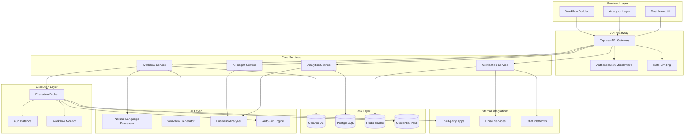
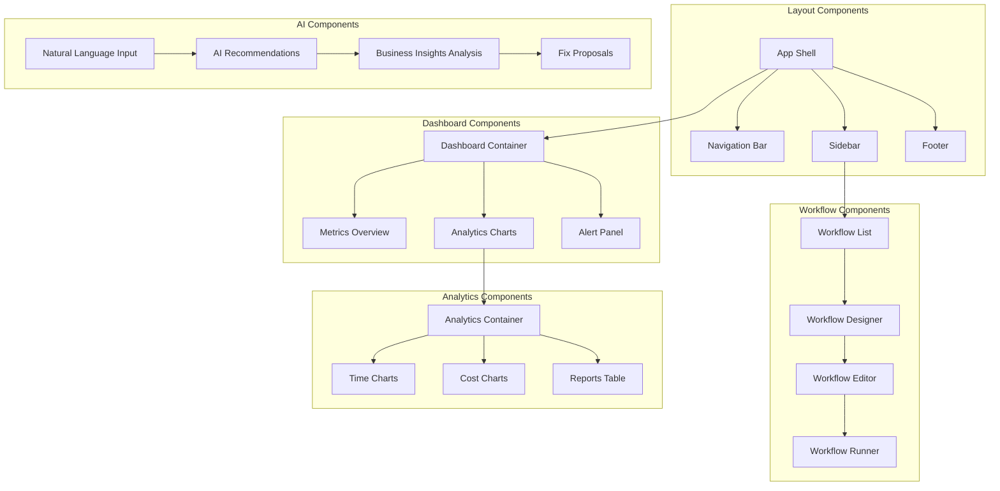
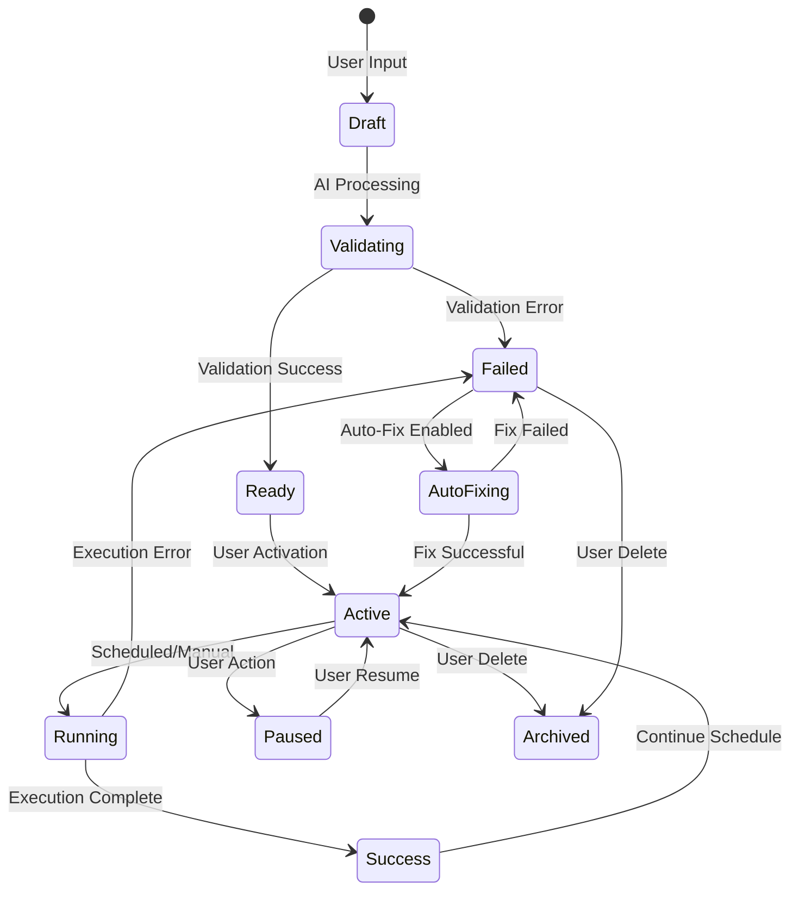

# Alfa Workflow Maker - AI Workflow Dashboard Design

## Overview

The Alfa Workflow Maker is an intelligent workflow automation platform that transforms natural language business requirements into executable n8n workflows. The system acts as an autonomous execution broker with advanced analytics, AI-powered business insights, and comprehensive workflow lifecycle management.

### Core Value Proposition
- **Natural Language to Automation**: Transform business descriptions into running workflows
- **Autonomous Execution**: Self-healing, self-optimizing workflow management
- **Business Intelligence**: AI-driven insights and ROI tracking
- **Enterprise Integration**: Seamless API connectivity with external platforms

## Technology Stack & Dependencies

### Frontend Stack
- **Framework**: React 18 with TypeScript
- **State Management**: Zustand for client state, React Query for server state
- **UI Library**: Tailwind CSS + Headless UI components
- **Charts & Analytics**: Recharts, D3.js for advanced visualizations
- **Real-time Updates**: Socket.io client
- **Authentication**: NextAuth.js with OAuth providers

### Backend Stack
- **Runtime**: Node.js with Express.js
- **Database**: Convex DB for real-time data, PostgreSQL for analytics
- **AI/ML**: OpenAI GPT-4, Pinecone for vector storage
- **Workflow Engine**: n8n API integration
- **Message Queue**: Redis with Bull Queue
- **Authentication**: JWT tokens, OAuth 2.0
- **Monitoring**: Winston logging, Prometheus metrics

### Infrastructure
- **Hosting**: Vercel (frontend), Railway/Heroku (backend)
- **CDN**: Cloudflare for asset delivery
- **Email**: SendGrid for notifications
- **File Storage**: AWS S3 for workflow artifacts
- **Security**: Vault for credential management

## Architecture

### High-Level System Architecture



### Component Architecture

#### Frontend Components



#### API Endpoints Reference

##### Workflow Management API

```typescript
// Workflow CRUD Operations
POST /api/workflows/create
GET /api/workflows/:id
PUT /api/workflows/:id
DELETE /api/workflows/:id
GET /api/workflows/user/:userId

// Natural Language Processing
POST /api/workflows/generate
{
  "description": "Connect Gmail to Google Sheets weekly",
  "businessContext": "Marketing agency email management",
  "userId": "user_123"
}

// Workflow Execution
POST /api/workflows/:id/execute
POST /api/workflows/:id/pause
POST /api/workflows/:id/resume
GET /api/workflows/:id/status
GET /api/workflows/:id/logs
```

##### Analytics & Reporting API

```typescript
// Time & Cost Analytics
GET /api/analytics/savings/:userId
GET /api/analytics/time-saved/:userId?period=monthly
GET /api/analytics/cost-saved/:userId?period=yearly

// Workflow Performance
GET /api/analytics/workflow-performance/:workflowId
GET /api/analytics/success-rates/:userId
GET /api/analytics/execution-trends/:userId

// Business Insights
GET /api/insights/recommendations/:userId
POST /api/insights/analyze-business
{
  "businessType": "e-commerce",
  "currentTools": ["shopify", "mailchimp"],
  "painPoints": ["manual inventory updates"]
}
```

##### AI Services API

```typescript
// Natural Language Processing
POST /api/ai/parse-intent
POST /api/ai/generate-workflow
POST /api/ai/suggest-improvements

// Auto-Fix Services
POST /api/ai/diagnose-error
POST /api/ai/suggest-fix
POST /api/ai/auto-repair

// Business Analysis
POST /api/ai/analyze-business-needs
GET /api/ai/workflow-suggestions/:userId
POST /api/ai/optimize-workflow/:workflowId
```

##### Integration API

```typescript
// Third-party App Connections
GET /api/integrations/available
POST /api/integrations/connect
DELETE /api/integrations/:id/disconnect
GET /api/integrations/:id/status

// OAuth Management
GET /api/auth/oauth/:provider/url
POST /api/auth/oauth/:provider/callback
PUT /api/auth/credentials/:id
```

## Data Models & ORM Mapping

### Core Data Models

```typescript
// User & Subscription Models
interface User {
  id: string;
  email: string;
  name: string;
  subscriptionTier: 'free' | 'starter' | 'pro' | 'business';
  subscriptionExpiry: Date;
  createdAt: Date;
  preferences: UserPreferences;
  businessProfile: BusinessProfile;
}

interface BusinessProfile {
  industry: string;
  companySize: string;
  currentTools: string[];
  painPoints: string[];
  goals: string[];
}

// Workflow Models
interface Workflow {
  id: string;
  userId: string;
  name: string;
  description: string;
  naturalLanguageInput: string;
  n8nWorkflowId: string;
  status: 'draft' | 'active' | 'paused' | 'failed';
  template: string;
  config: WorkflowConfig;
  credentials: CredentialRef[];
  createdAt: Date;
  lastExecuted: Date;
  executionCount: number;
  successRate: number;
}

interface WorkflowConfig {
  schedule: string;
  retryPolicy: RetryPolicy;
  notifications: NotificationConfig;
  autoFix: boolean;
  variables: Record<string, any>;
}

// Analytics Models
interface WorkflowExecution {
  id: string;
  workflowId: string;
  status: 'success' | 'failed' | 'running';
  startTime: Date;
  endTime?: Date;
  duration?: number;
  timeSaved: number; // in minutes
  costSaved: number; // in USD
  errorMessage?: string;
  logs: ExecutionLog[];
}

interface Analytics {
  userId: string;
  period: 'daily' | 'weekly' | 'monthly' | 'yearly';
  date: Date;
  totalTimeSaved: number;
  totalCostSaved: number;
  workflowsExecuted: number;
  successfulExecutions: number;
  failedExecutions: number;
  topPerformingWorkflows: string[];
}

// AI Insights Models
interface BusinessInsight {
  id: string;
  userId: string;
  type: 'recommendation' | 'optimization' | 'alert';
  title: string;
  description: string;
  potentialSavings: number;
  implementationEffort: 'low' | 'medium' | 'high';
  priority: number;
  status: 'new' | 'viewed' | 'implemented' | 'dismissed';
  createdAt: Date;
}

interface WorkflowTemplate {
  id: string;
  name: string;
  category: string;
  description: string;
  estimatedTimeSavings: number;
  complexity: 'beginner' | 'intermediate' | 'advanced';
  requiredApps: string[];
  n8nTemplate: object;
  usageCount: number;
}
```

### Database Schema

```sql
-- Users and Subscriptions
CREATE TABLE users (
    id UUID PRIMARY KEY DEFAULT gen_random_uuid(),
    email VARCHAR UNIQUE NOT NULL,
    name VARCHAR NOT NULL,
    subscription_tier subscription_tier_enum DEFAULT 'free',
    subscription_expiry TIMESTAMP,
    business_profile JSONB,
    preferences JSONB,
    created_at TIMESTAMP DEFAULT NOW()
);

-- Workflows
CREATE TABLE workflows (
    id UUID PRIMARY KEY DEFAULT gen_random_uuid(),
    user_id UUID REFERENCES users(id),
    name VARCHAR NOT NULL,
    description TEXT,
    natural_language_input TEXT,
    n8n_workflow_id VARCHAR,
    status workflow_status_enum DEFAULT 'draft',
    config JSONB,
    created_at TIMESTAMP DEFAULT NOW(),
    updated_at TIMESTAMP DEFAULT NOW()
);

-- Workflow Executions
CREATE TABLE workflow_executions (
    id UUID PRIMARY KEY DEFAULT gen_random_uuid(),
    workflow_id UUID REFERENCES workflows(id),
    status execution_status_enum,
    start_time TIMESTAMP DEFAULT NOW(),
    end_time TIMESTAMP,
    duration INTEGER,
    time_saved INTEGER,
    cost_saved DECIMAL(10,2),
    error_message TEXT,
    logs JSONB
);

-- Analytics Aggregations
CREATE TABLE analytics_daily (
    user_id UUID REFERENCES users(id),
    date DATE,
    total_time_saved INTEGER,
    total_cost_saved DECIMAL(10,2),
    workflows_executed INTEGER,
    successful_executions INTEGER,
    failed_executions INTEGER,
    PRIMARY KEY (user_id, date)
);

-- AI Insights
CREATE TABLE business_insights (
    id UUID PRIMARY KEY DEFAULT gen_random_uuid(),
    user_id UUID REFERENCES users(id),
    type insight_type_enum,
    title VARCHAR NOT NULL,
    description TEXT,
    potential_savings DECIMAL(10,2),
    implementation_effort effort_enum,
    priority INTEGER,
    status insight_status_enum DEFAULT 'new',
    created_at TIMESTAMP DEFAULT NOW()
);
```

## Business Logic Layer

### Workflow Lifecycle Management



### AI Workflow Generation Engine

#### Natural Language Processing Pipeline

```typescript
class WorkflowGenerator {
  async generateWorkflow(input: string, context: BusinessProfile): Promise<WorkflowSpec> {
    // Step 1: Intent Recognition
    const intent = await this.parseIntent(input);
    
    // Step 2: Entity Extraction
    const entities = await this.extractEntities(input);
    
    // Step 3: Template Matching
    const template = await this.findBestTemplate(intent, entities);
    
    // Step 4: Configuration Generation
    const config = await this.generateConfig(template, entities, context);
    
    // Step 5: Validation
    const validation = await this.validateWorkflow(config);
    
    return {
      template,
      config,
      validation,
      estimatedSavings: this.calculateSavings(template, context)
    };
  }
  
  private async parseIntent(input: string): Promise<Intent> {
    const prompt = `
      Analyze this business automation request and extract the intent:
      "${input}"
      
      Return structured intent with:
      - action: create, sync, notify, process, analyze
      - source: where data comes from
      - destination: where data goes to
      - frequency: how often to run
      - conditions: any triggering conditions
    `;
    
    return await this.openAI.generateStructured(prompt, IntentSchema);
  }
}
```

### Auto-Fix Engine

```typescript
class AutoFixEngine {
  async diagnoseAndFix(execution: WorkflowExecution): Promise<FixResult> {
    const error = await this.categorizeError(execution.errorMessage);
    
    switch (error.type) {
      case 'CREDENTIAL_ERROR':
        return await this.fixCredentialIssue(execution);
      case 'API_ERROR':
        return await this.fixApiIssue(execution);
      case 'DATA_FORMAT_ERROR':
        return await this.fixDataFormatIssue(execution);
      case 'RATE_LIMIT_ERROR':
        return await this.implementRetryLogic(execution);
      default:
        return await this.escalateToHuman(execution);
    }
  }
  
  private async fixCredentialIssue(execution: WorkflowExecution): Promise<FixResult> {
    // Check credential expiry
    // Refresh OAuth tokens if possible
    // Guide user through re-authorization
    // Update workflow configuration
  }
}
```

### Business Intelligence Engine

```typescript
class BusinessIntelligenceEngine {
  async analyzeBusinessNeeds(user: User): Promise<BusinessInsight[]> {
    const profile = user.businessProfile;
    const currentWorkflows = await this.getWorkflows(user.id);
    const industryBenchmarks = await this.getIndustryBenchmarks(profile.industry);
    
    const insights = [];
    
    // Identify automation gaps
    const gaps = await this.identifyAutomationGaps(profile, currentWorkflows);
    insights.push(...gaps);
    
    // Suggest optimizations
    const optimizations = await this.suggestOptimizations(currentWorkflows);
    insights.push(...optimizations);
    
    // Benchmark against industry
    const benchmarkInsights = await this.benchmarkAnalysis(user, industryBenchmarks);
    insights.push(...benchmarkInsights);
    
    return this.prioritizeInsights(insights);
  }
  
  async calculateROI(workflow: Workflow, executions: WorkflowExecution[]): Promise<ROIMetrics> {
    const totalTimeSaved = executions.reduce((sum, e) => sum + e.timeSaved, 0);
    const averageHourlyRate = await this.getAverageHourlyRate(workflow.userId);
    const costSaved = (totalTimeSaved / 60) * averageHourlyRate;
    
    return {
      timeSavedHours: totalTimeSaved / 60,
      costSaved,
      executionCount: executions.length,
      efficiency: executions.filter(e => e.status === 'success').length / executions.length,
      monthlyProjection: this.projectMonthlySavings(costSaved, executions)
    };
  }
}
```

## State Management

### Frontend State Architecture

```typescript
// Zustand Store for Client State
interface AppState {
  // User State
  user: User | null;
  subscription: Subscription | null;
  
  // Workflow State
  workflows: Workflow[];
  activeWorkflow: Workflow | null;
  workflowExecutions: WorkflowExecution[];
  
  // Analytics State
  analytics: Analytics;
  insights: BusinessInsight[];
  
  // UI State
  sidebarOpen: boolean;
  selectedPeriod: 'day' | 'week' | 'month' | 'year';
  selectedChart: 'time' | 'cost' | 'efficiency';
  
  // Actions
  setUser: (user: User) => void;
  addWorkflow: (workflow: Workflow) => void;
  updateWorkflow: (id: string, updates: Partial<Workflow>) => void;
  setAnalyticsPeriod: (period: string) => void;
}

// React Query for Server State
const useWorkflows = (userId: string) => {
  return useQuery({
    queryKey: ['workflows', userId],
    queryFn: () => workflowApi.getWorkflows(userId),
    staleTime: 5 * 60 * 1000, // 5 minutes
  });
};

const useAnalytics = (userId: string, period: string) => {
  return useQuery({
    queryKey: ['analytics', userId, period],
    queryFn: () => analyticsApi.getAnalytics(userId, period),
    refetchInterval: 30000, // Refresh every 30 seconds
  });
};
```

### Real-time Updates

```typescript
// Socket.io Integration
class RealtimeService {
  private socket: Socket;
  
  constructor(userId: string) {
    this.socket = io('/workflow-updates', {
      auth: { userId }
    });
    
    this.setupEventHandlers();
  }
  
  private setupEventHandlers() {
    this.socket.on('workflow-execution-started', (data) => {
      this.updateWorkflowStatus(data.workflowId, 'running');
    });
    
    this.socket.on('workflow-execution-completed', (data) => {
      this.updateWorkflowStatus(data.workflowId, 'active');
      this.updateAnalytics(data.analytics);
    });
    
    this.socket.on('workflow-execution-failed', (data) => {
      this.updateWorkflowStatus(data.workflowId, 'failed');
      this.showNotification('error', data.message);
    });
    
    this.socket.on('new-insight', (insight) => {
      this.addBusinessInsight(insight);
    });
  }
}
```

## API Integration Layer

### External Service Integrations

```typescript
// Third-party App Integration Manager
class IntegrationManager {
  private integrations = new Map<string, IntegrationAdapter>();
  
  constructor() {
    this.registerIntegrations();
  }
  
  private registerIntegrations() {
    this.integrations.set('google-sheets', new GoogleSheetsAdapter());
    this.integrations.set('slack', new SlackAdapter());
    this.integrations.set('notion', new NotionAdapter());
    this.integrations.set('airtable', new AirtableAdapter());
    this.integrations.set('gmail', new GmailAdapter());
    // ... more integrations
  }
  
  async connectApp(userId: string, appId: string, credentials: any): Promise<Connection> {
    const adapter = this.integrations.get(appId);
    if (!adapter) throw new Error(`Integration ${appId} not supported`);
    
    const connection = await adapter.connect(credentials);
    await this.storeConnection(userId, appId, connection);
    
    return connection;
  }
  
  async testConnection(userId: string, appId: string): Promise<boolean> {
    const adapter = this.integrations.get(appId);
    const credentials = await this.getStoredCredentials(userId, appId);
    
    return await adapter.testConnection(credentials);
  }
}

// Example Integration Adapter
class GoogleSheetsAdapter implements IntegrationAdapter {
  async connect(credentials: OAuthCredentials): Promise<Connection> {
    const auth = new google.auth.OAuth2(
      process.env.GOOGLE_CLIENT_ID,
      process.env.GOOGLE_CLIENT_SECRET,
      credentials.redirectUri
    );
    
    auth.setCredentials({
      access_token: credentials.accessToken,
      refresh_token: credentials.refreshToken
    });
    
    return {
      id: generateId(),
      provider: 'google-sheets',
      auth,
      capabilities: ['read', 'write', 'create_sheet'],
      status: 'active'
    };
  }
  
  async testConnection(connection: Connection): Promise<boolean> {
    try {
      const sheets = google.sheets({ version: 'v4', auth: connection.auth });
      await sheets.spreadsheets.get({ spreadsheetId: 'test-sheet-id' });
      return true;
    } catch {
      return false;
    }
  }
}
```

### Public API for External Integration

```typescript
// Public API Routes for Third-party Integration
app.use('/api/public/v1', authenticateAPIKey, rateLimitByKey);

// Webhook endpoints for external systems
app.post('/api/public/v1/workflows/:id/trigger', async (req, res) => {
  const { id } = req.params;
  const { data } = req.body;
  
  try {
    const execution = await workflowService.triggerWorkflow(id, data);
    res.json({ 
      success: true, 
      executionId: execution.id,
      status: execution.status 
    });
  } catch (error) {
    res.status(400).json({ success: false, error: error.message });
  }
});

// Get workflow status
app.get('/api/public/v1/workflows/:id/status', async (req, res) => {
  const { id } = req.params;
  const status = await workflowService.getWorkflowStatus(id);
  res.json(status);
});

// Get analytics data
app.get('/api/public/v1/analytics/:userId', async (req, res) => {
  const { userId } = req.params;
  const { period = 'month' } = req.query;
  
  const analytics = await analyticsService.getAnalytics(userId, period);
  res.json(analytics);
});
```

## Routing & Navigation

### Frontend Route Structure

```typescript
// React Router Configuration
const AppRoutes = () => {
  return (
    <BrowserRouter>
      <Routes>
        {/* Public Routes */}
        <Route path="/" element={<LandingPage />} />
        <Route path="/login" element={<LoginPage />} />
        <Route path="/signup" element={<SignupPage />} />
        <Route path="/pricing" element={<PricingPage />} />
        
        {/* Protected Dashboard Routes */}
        <Route path="/dashboard" element={<ProtectedRoute><DashboardLayout /></ProtectedRoute>}>
          <Route index element={<DashboardOverview />} />
          
          {/* Workflow Management */}
          <Route path="workflows" element={<WorkflowList />} />
          <Route path="workflows/new" element={<WorkflowBuilder />} />
          <Route path="workflows/:id" element={<WorkflowDetail />} />
          <Route path="workflows/:id/edit" element={<WorkflowEditor />} />
          <Route path="workflows/:id/logs" element={<WorkflowLogs />} />
          
          {/* Analytics & Reporting */}
          <Route path="analytics" element={<AnalyticsOverview />} />
          <Route path="analytics/time-savings" element={<TimeSavingsReport />} />
          <Route path="analytics/cost-savings" element={<CostSavingsReport />} />
          <Route path="analytics/workflow-performance" element={<WorkflowPerformanceReport />} />
          
          {/* AI Insights */}
          <Route path="insights" element={<BusinessInsights />} />
          <Route path="insights/recommendations" element={<AIRecommendations />} />
          <Route path="insights/business-analysis" element={<BusinessAnalysis />} />
          
          {/* Integrations */}
          <Route path="integrations" element={<IntegrationsList />} />
          <Route path="integrations/connect" element={<ConnectIntegration />} />
          <Route path="integrations/:id/configure" element={<ConfigureIntegration />} />
          
          {/* Settings */}
          <Route path="settings" element={<UserSettings />} />
          <Route path="settings/subscription" element={<SubscriptionSettings />} />
          <Route path="settings/notifications" element={<NotificationSettings />} />
          <Route path="settings/api" element={<APISettings />} />
        </Route>
        
        {/* API Documentation */}
        <Route path="/docs" element={<APIDocumentation />} />
        <Route path="/docs/api" element={<APIReference />} />
        <Route path="/docs/integrations" element={<IntegrationGuides />} />
        
        {/* Error Routes */}
        <Route path="/404" element={<NotFoundPage />} />
        <Route path="*" element={<Navigate to="/404" />} />
      </Routes>
    </BrowserRouter>
  );
};

// Navigation Guard for Protected Routes
const ProtectedRoute = ({ children }: { children: React.ReactNode }) => {
  const { user, loading } = useAuth();
  
  if (loading) return <LoadingSpinner />;
  if (!user) return <Navigate to="/login" />;
  
  return <>{children}</>;
};
```

## Styling Strategy

### Tailwind CSS Configuration

```typescript
// tailwind.config.js
module.exports = {
  content: ['./src/**/*.{js,ts,jsx,tsx}'],
  theme: {
    extend: {
      colors: {
        primary: {
          50: '#eff6ff',
          500: '#3b82f6',
          600: '#2563eb',
          700: '#1d4ed8'
        },
        success: {
          50: '#f0fdf4',
          500: '#22c55e',
          600: '#16a34a'
        },
        warning: {
          50: '#fffbeb',
          500: '#f59e0b',
          600: '#d97706'
        },
        error: {
          50: '#fef2f2',
          500: '#ef4444',
          600: '#dc2626'
        }
      },
      fontFamily: {
        sans: ['Inter', 'system-ui', 'sans-serif']
      },
      animation: {
        'fade-in': 'fadeIn 0.5s ease-in-out',
        'slide-up': 'slideUp 0.3s ease-out',
        'pulse-slow': 'pulse 3s infinite'
      }
    }
  },
  plugins: [
    require('@tailwindcss/forms'),
    require('@tailwindcss/typography')
  ]
};

// Component Styling Patterns
const Button = styled.button`
  @apply px-4 py-2 rounded-lg font-medium transition-all duration-200;
  
  &.primary {
    @apply bg-primary-600 text-white hover:bg-primary-700;
  }
  
  &.secondary {
    @apply bg-gray-200 text-gray-900 hover:bg-gray-300;
  }
  
  &.success {
    @apply bg-success-600 text-white hover:bg-success-700;
  }
  
  &:disabled {
    @apply opacity-50 cursor-not-allowed;
  }
`;
```

### Design System Components

```typescript
// Reusable UI Components
export const Card = ({ children, className = '', ...props }) => (
  <div 
    className={`bg-white rounded-lg shadow-sm border border-gray-200 ${className}`}
    {...props}
  >
    {children}
  </div>
);

export const MetricCard = ({ title, value, change, trend, icon: Icon }) => (
  <Card className="p-6">
    <div className="flex items-center justify-between">
      <div>
        <p className="text-sm text-gray-600">{title}</p>
        <p className="text-2xl font-bold text-gray-900">{value}</p>
        {change && (
          <p className={`text-sm ${trend === 'up' ? 'text-success-600' : 'text-error-600'}`}>
            {trend === 'up' ? '↗' : '↘'} {change}
          </p>
        )}
      </div>
      {Icon && (
        <div className="p-3 bg-primary-50 rounded-lg">
          <Icon className="w-6 h-6 text-primary-600" />
        </div>
      )}
    </div>
  </Card>
);

export const ChartContainer = ({ title, children, actions }) => (
  <Card className="p-6">
    <div className="flex items-center justify-between mb-6">
      <h3 className="text-lg font-semibold text-gray-900">{title}</h3>
      {actions && <div className="flex gap-2">{actions}</div>}
    </div>
    <div className="h-80">
      {children}
    </div>
  </Card>
);
```

## Implementation Status

### Phase 1: Database & Models ✅
- Enhanced PostgreSQL schema with proper indexes
- Database models with TypeScript interfaces
- Analytics aggregation tables
- Business insights storage

### Phase 2: AI Integration 🔄
- Natural language processing pipeline
- Workflow generation engine
- Auto-fix system implementation
- n8n API integration

### Phase 3: Analytics Dashboard 📋
- Real-time metrics visualization
- ROI calculations
- Business insights display
- Interactive charts and reports

### Phase 4: Advanced Features 🎯
- Auto-healing workflows
- Business intelligence engine
- Subscription management
- API integration layer

## Database Models Implementation

### Enhanced User Model

```typescript
// backend/src/models/User.ts
import { Pool } from 'pg';
import { DatabaseService } from '../services/databaseService';
import { User, BusinessProfile, UserPreferences } from '../../../shared/types';
import bcrypt from 'bcryptjs';

export class UserModel {
  private static pool: Pool;

  static initialize() {
    this.pool = DatabaseService.getPool();
  }

  static async create(userData: Partial<User> & { password: string }): Promise<User> {
    const hashedPassword = await bcrypt.hash(userData.password, 12);
    
    const query = `
      INSERT INTO users (email, name, password_hash, subscription_tier, business_profile, preferences)
      VALUES ($1, $2, $3, $4, $5, $6)
      RETURNING id, email, name, subscription_tier, subscription_expiry, business_profile, preferences, created_at
    `;
    
    const values = [
      userData.email,
      userData.name,
      hashedPassword,
      userData.subscriptionTier || 'free',
      JSON.stringify(userData.businessProfile || {}),
      JSON.stringify(userData.preferences || {
        theme: 'system',
        notifications: { email: true, push: true, slack: false },
        dashboard: { defaultPeriod: 'month', defaultCharts: ['time-savings', 'cost-savings'] }
      })
    ];
    
    const result = await this.pool.query(query, values);
    return this.formatUser(result.rows[0]);
  }

  static async findById(id: string): Promise<User | null> {
    const query = 'SELECT * FROM users WHERE id = $1';
    const result = await this.pool.query(query, [id]);
    return result.rows[0] ? this.formatUser(result.rows[0]) : null;
  }

  static async findByEmail(email: string): Promise<User | null> {
    const query = 'SELECT * FROM users WHERE email = $1';
    const result = await this.pool.query(query, [email]);
    return result.rows[0] ? this.formatUser(result.rows[0]) : null;
  }

  static async updateSubscription(userId: string, tier: string, expiry?: Date): Promise<void> {
    const query = `
      UPDATE users 
      SET subscription_tier = $1, subscription_expiry = $2, updated_at = NOW()
      WHERE id = $3
    `;
    await this.pool.query(query, [tier, expiry, userId]);
  }

  static async updateBusinessProfile(userId: string, profile: BusinessProfile): Promise<void> {
    const query = `
      UPDATE users 
      SET business_profile = $1, updated_at = NOW()
      WHERE id = $2
    `;
    await this.pool.query(query, [JSON.stringify(profile), userId]);
  }

  static async verifyPassword(email: string, password: string): Promise<User | null> {
    const query = 'SELECT * FROM users WHERE email = $1';
    const result = await this.pool.query(query, [email]);
    
    if (result.rows[0]) {
      const user = result.rows[0];
      const isValid = await bcrypt.compare(password, user.password_hash);
      if (isValid) {
        return this.formatUser(user);
      }
    }
    return null;
  }

  private static formatUser(dbUser: any): User {
    return {
      id: dbUser.id,
      email: dbUser.email,
      name: dbUser.name,
      subscriptionTier: dbUser.subscription_tier,
      subscriptionExpiry: dbUser.subscription_expiry,
      createdAt: dbUser.created_at,
      preferences: dbUser.preferences || {},
      businessProfile: dbUser.business_profile || {}
    };
  }
}
```

### Enhanced Workflow Model

```typescript
// backend/src/models/Workflow.ts
import { Pool } from 'pg';
import { DatabaseService } from '../services/databaseService';
import { Workflow, WorkflowConfig } from '../../../shared/types';

export class WorkflowModel {
  private static pool: Pool;

  static initialize() {
    this.pool = DatabaseService.getPool();
  }

  static async create(workflowData: Partial<Workflow>): Promise<Workflow> {
    const query = `
      INSERT INTO workflows (
        user_id, name, description, natural_language_input, 
        status, template, config, estimated_time_savings, estimated_cost_savings
      )
      VALUES ($1, $2, $3, $4, $5, $6, $7, $8, $9)
      RETURNING *
    `;
    
    const values = [
      workflowData.userId,
      workflowData.name,
      workflowData.description,
      workflowData.naturalLanguageInput,
      workflowData.status || 'draft',
      workflowData.template,
      JSON.stringify(workflowData.config || {}),
      workflowData.estimatedTimeSavings || 0,
      workflowData.estimatedCostSavings || 0
    ];
    
    const result = await this.pool.query(query, values);
    return this.formatWorkflow(result.rows[0]);
  }

  static async findByUserId(userId: string, limit = 50, offset = 0): Promise<Workflow[]> {
    const query = `
      SELECT * FROM workflows 
      WHERE user_id = $1 
      ORDER BY created_at DESC 
      LIMIT $2 OFFSET $3
    `;
    const result = await this.pool.query(query, [userId, limit, offset]);
    return result.rows.map(this.formatWorkflow);
  }

  static async findById(id: string): Promise<Workflow | null> {
    const query = 'SELECT * FROM workflows WHERE id = $1';
    const result = await this.pool.query(query, [id]);
    return result.rows[0] ? this.formatWorkflow(result.rows[0]) : null;
  }

  static async updateStatus(id: string, status: string): Promise<void> {
    const query = `
      UPDATE workflows 
      SET status = $1, updated_at = NOW() 
      WHERE id = $2
    `;
    await this.pool.query(query, [status, id]);
  }

  static async updateExecutionStats(id: string, executionCount: number, successRate: number): Promise<void> {
    const query = `
      UPDATE workflows 
      SET execution_count = $1, success_rate = $2, last_executed = NOW(), updated_at = NOW()
      WHERE id = $3
    `;
    await this.pool.query(query, [executionCount, successRate, id]);
  }

  static async setN8nWorkflowId(id: string, n8nId: string): Promise<void> {
    const query = `
      UPDATE workflows 
      SET n8n_workflow_id = $1, updated_at = NOW()
      WHERE id = $2
    `;
    await this.pool.query(query, [n8nId, id]);
  }

  private static formatWorkflow(dbWorkflow: any): Workflow {
    return {
      id: dbWorkflow.id,
      userId: dbWorkflow.user_id,
      name: dbWorkflow.name,
      description: dbWorkflow.description,
      naturalLanguageInput: dbWorkflow.natural_language_input,
      n8nWorkflowId: dbWorkflow.n8n_workflow_id,
      status: dbWorkflow.status,
      template: dbWorkflow.template,
      config: dbWorkflow.config || {},
      credentials: dbWorkflow.credentials || [],
      createdAt: dbWorkflow.created_at,
      lastExecuted: dbWorkflow.last_executed,
      executionCount: dbWorkflow.execution_count || 0,
      successRate: dbWorkflow.success_rate || 0,
      estimatedTimeSavings: dbWorkflow.estimated_time_savings || 0,
      estimatedCostSavings: dbWorkflow.estimated_cost_savings || 0
    };
  }
}
```

### Analytics Model

```typescript
// backend/src/models/Analytics.ts
import { Pool } from 'pg';
import { DatabaseService } from '../services/databaseService';
import { Analytics, ROIMetrics } from '../../../shared/types';

export class AnalyticsModel {
  private static pool: Pool;

  static initialize() {
    this.pool = DatabaseService.getPool();
  }

  static async getDailyAnalytics(userId: string, startDate: Date, endDate: Date): Promise<Analytics[]> {
    const query = `
      SELECT * FROM analytics_daily 
      WHERE user_id = $1 AND date BETWEEN $2 AND $3
      ORDER BY date ASC
    `;
    const result = await this.pool.query(query, [userId, startDate, endDate]);
    return result.rows.map(this.formatAnalytics);
  }

  static async updateDailyAnalytics(userId: string, date: Date, data: Partial<Analytics>): Promise<void> {
    const query = `
      INSERT INTO analytics_daily (
        user_id, date, total_time_saved, total_cost_saved, 
        workflows_executed, successful_executions, failed_executions,
        avg_execution_time, efficiency, top_performing_workflows
      )
      VALUES ($1, $2, $3, $4, $5, $6, $7, $8, $9, $10)
      ON CONFLICT (user_id, date) 
      DO UPDATE SET
        total_time_saved = EXCLUDED.total_time_saved,
        total_cost_saved = EXCLUDED.total_cost_saved,
        workflows_executed = EXCLUDED.workflows_executed,
        successful_executions = EXCLUDED.successful_executions,
        failed_executions = EXCLUDED.failed_executions,
        avg_execution_time = EXCLUDED.avg_execution_time,
        efficiency = EXCLUDED.efficiency,
        top_performing_workflows = EXCLUDED.top_performing_workflows
    `;
    
    await this.pool.query(query, [
      userId,
      date,
      data.totalTimeSaved || 0,
      data.totalCostSaved || 0,
      data.workflowsExecuted || 0,
      data.successfulExecutions || 0,
      data.failedExecutions || 0,
      data.avgExecutionTime || 0,
      data.efficiency || 0,
      JSON.stringify(data.topPerformingWorkflows || [])
    ]);
  }

  static async calculateROI(userId: string, workflowId?: string): Promise<ROIMetrics> {
    let query = `
      SELECT 
        COALESCE(SUM(time_saved), 0) as total_time_saved,
        COALESCE(SUM(cost_saved), 0) as total_cost_saved,
        COUNT(*) as execution_count,
        COALESCE(AVG(CASE WHEN status = 'success' THEN 1 ELSE 0 END), 0) as efficiency
      FROM workflow_executions we
      JOIN workflows w ON we.workflow_id = w.id
      WHERE w.user_id = $1
    `;
    
    const params = [userId];
    
    if (workflowId) {
      query += ' AND we.workflow_id = $2';
      params.push(workflowId);
    }
    
    const result = await this.pool.query(query, params);
    const data = result.rows[0];
    
    const timeSavedHours = parseInt(data.total_time_saved) / 60;
    const costSaved = parseFloat(data.total_cost_saved);
    const monthlyProjection = costSaved * (30 / Math.max(1, data.execution_count));
    
    return {
      timeSavedHours,
      costSaved,
      executionCount: parseInt(data.execution_count),
      efficiency: parseFloat(data.efficiency),
      monthlyProjection,
      yearlyProjection: monthlyProjection * 12
    };
  }

  private static formatAnalytics(dbAnalytics: any): Analytics {
    return {
      userId: dbAnalytics.user_id,
      period: 'daily',
      date: dbAnalytics.date,
      totalTimeSaved: dbAnalytics.total_time_saved || 0,
      totalCostSaved: parseFloat(dbAnalytics.total_cost_saved) || 0,
      workflowsExecuted: dbAnalytics.workflows_executed || 0,
      successfulExecutions: dbAnalytics.successful_executions || 0,
      failedExecutions: dbAnalytics.failed_executions || 0,
      topPerformingWorkflows: dbAnalytics.top_performing_workflows || [],
      avgExecutionTime: dbAnalytics.avg_execution_time || 0,
      efficiency: parseFloat(dbAnalytics.efficiency) || 0
    };
  }
}
```

## STEP 2: AI Integration Services Implementation

### Natural Language Processing Service

```typescript
// backend/src/services/aiService.ts
import OpenAI from 'openai';
import { logger } from '../utils/logger';
import { Intent, WorkflowSpec, WorkflowTemplate } from '../../../shared/types';
import { WorkflowTemplateModel } from '../models/WorkflowTemplate';

interface GeneratedWorkflow {
  name: string;
  description: string;
  nodes: any[];
  connections: any[];
  settings: any;
}

export class AIService {
  private static openai: OpenAI;
  private static initialized = false;

  static initialize() {
    if (this.initialized) return;
    
    this.openai = new OpenAI({
      apiKey: process.env.OPENAI_API_KEY,
    });
    this.initialized = true;
    logger.info('AI Service initialized');
  }

  static async parseIntent(input: string, businessContext?: any): Promise<Intent> {
    try {
      const prompt = `
Analyze this automation request and extract structured intent:
"${input}"

Business Context: ${JSON.stringify(businessContext || {})}

Return a JSON object with:
{
  "action": "create|sync|notify|process|analyze",
  "source": "where data comes from",
  "destination": "where data goes to", 
  "frequency": "how often to run",
  "conditions": ["any triggering conditions"],
  "confidence": 0.0-1.0
}

Only return valid JSON, no other text.`;

      const response = await this.openai.chat.completions.create({
        model: process.env.OPENAI_MODEL || 'gpt-4',
        messages: [{ role: 'user', content: prompt }],
        max_tokens: 300,
        temperature: 0.1
      });

      const content = response.choices[0]?.message?.content;
      if (!content) throw new Error('No response from OpenAI');

      return JSON.parse(content) as Intent;
    } catch (error) {
      logger.error('Intent parsing failed:', error);
      throw new Error('Failed to parse automation intent');
    }
  }

  static async generateWorkflow(intent: Intent, userId: string): Promise<WorkflowSpec> {
    try {
      // Find best matching template
      const template = await this.findBestTemplate(intent);
      
      // Generate n8n workflow configuration
      const workflowConfig = await this.generateN8nWorkflow(intent, template);
      
      // Estimate savings
      const estimatedSavings = await this.calculateEstimatedSavings(intent, template);
      
      return {
        template,
        config: {
          schedule: this.parseSchedule(intent.frequency),
          retryPolicy: { maxRetries: 3, retryDelay: 5000, backoffMultiplier: 2 },
          notifications: { onSuccess: false, onFailure: true, channels: ['email'] },
          autoFix: true,
          variables: {},
          timeout: 300000
        },
        validation: { isValid: true, errors: [], warnings: [], suggestions: [] },
        estimatedSavings
      };
    } catch (error) {
      logger.error('Workflow generation failed:', error);
      throw new Error('Failed to generate workflow');
    }
  }

  private static async findBestTemplate(intent: Intent): Promise<WorkflowTemplate> {
    const templates = await WorkflowTemplateModel.findByCategory(
      this.categorizeIntent(intent)
    );
    
    if (templates.length === 0) {
      return this.createCustomTemplate(intent);
    }
    
    // Score templates based on intent matching
    const scoredTemplates = templates.map(template => ({
      template,
      score: this.scoreTemplateMatch(intent, template)
    }));
    
    scoredTemplates.sort((a, b) => b.score - a.score);
    return scoredTemplates[0].template;
  }

  private static async generateN8nWorkflow(intent: Intent, template: WorkflowTemplate): Promise<any> {
    const prompt = `
Create an n8n workflow JSON configuration for:
Intent: ${JSON.stringify(intent)}
Template: ${template.name}

Generate a complete n8n workflow with:
1. Trigger node (webhook, schedule, or manual)
2. Processing nodes for the automation
3. Output nodes for the destination
4. Error handling

Return valid n8n workflow JSON structure with nodes and connections.
Make sure all node IDs are unique and connections are properly mapped.`;

    const response = await this.openai.chat.completions.create({
      model: process.env.OPENAI_MODEL || 'gpt-4',
      messages: [{ role: 'user', content: prompt }],
      max_tokens: 2000,
      temperature: 0.2
    });

    const content = response.choices[0]?.message?.content;
    if (!content) throw new Error('No workflow generated');

    try {
      return JSON.parse(content);
    } catch {
      // If JSON parsing fails, extract JSON from response
      const jsonMatch = content.match(/\{[\s\S]*\}/);
      if (jsonMatch) {
        return JSON.parse(jsonMatch[0]);
      }
      throw new Error('Invalid workflow JSON generated');
    }
  }

  private static async calculateEstimatedSavings(intent: Intent, template: WorkflowTemplate): Promise<any> {
    // Base calculation on template and frequency
    const baseTimeSavings = template.estimatedTimeSavings || 30; // minutes
    const frequency = this.parseFrequency(intent.frequency);
    const hourlyRate = 25; // Default hourly rate in USD
    
    const dailySavings = baseTimeSavings * frequency.dailyOccurrences;
    const monthlySavings = dailySavings * 30;
    const yearlySavings = monthlySavings * 12;
    
    return {
      timeSavedHours: dailySavings / 60,
      costSaved: (dailySavings / 60) * hourlyRate,
      executionCount: 0,
      efficiency: 0.95, // Estimated
      monthlyProjection: (monthlySavings / 60) * hourlyRate,
      yearlyProjection: (yearlySavings / 60) * hourlyRate
    };
  }

  private static categorizeIntent(intent: Intent): string {
    const { source, destination, action } = intent;
    
    if (source.includes('gmail') || source.includes('email')) return 'email-automation';
    if (source.includes('sheets') || destination.includes('sheets')) return 'data-processing';
    if (source.includes('slack') || destination.includes('slack')) return 'communication';
    if (action === 'notify') return 'notifications';
    if (action === 'sync') return 'data-sync';
    
    return 'general-automation';
  }

  private static scoreTemplateMatch(intent: Intent, template: WorkflowTemplate): number {
    let score = 0;
    
    // Check if required apps match
    template.requiredApps.forEach(app => {
      if (intent.source.toLowerCase().includes(app.toLowerCase()) ||
          intent.destination.toLowerCase().includes(app.toLowerCase())) {
        score += 30;
      }
    });
    
    // Check category match
    if (template.category === this.categorizeIntent(intent)) {
      score += 20;
    }
    
    // Check action match in description
    if (template.description.toLowerCase().includes(intent.action.toLowerCase())) {
      score += 15;
    }
    
    // Popularity bonus
    score += Math.min(template.usageCount / 100, 10);
    
    return score;
  }

  private static createCustomTemplate(intent: Intent): WorkflowTemplate {
    return {
      id: 'custom-' + Date.now(),
      name: `Custom ${intent.action} automation`,
      category: this.categorizeIntent(intent),
      description: `Automated workflow for ${intent.source} to ${intent.destination}`,
      estimatedTimeSavings: 30,
      complexity: 'intermediate',
      requiredApps: [intent.source, intent.destination].filter(Boolean),
      n8nTemplate: {},
      usageCount: 0,
      tags: [intent.action],
      rating: 0,
      reviews: 0
    };
  }

  private static parseSchedule(frequency: string): string {
    const freq = frequency.toLowerCase();
    
    if (freq.includes('daily')) return '0 9 * * *'; // 9 AM daily
    if (freq.includes('weekly')) return '0 9 * * 1'; // 9 AM Monday
    if (freq.includes('monthly')) return '0 9 1 * *'; // 9 AM 1st of month
    if (freq.includes('hourly')) return '0 * * * *'; // Every hour
    
    return '0 9 * * *'; // Default to daily
  }

  private static parseFrequency(frequency: string): { dailyOccurrences: number } {
    const freq = frequency.toLowerCase();
    
    if (freq.includes('hourly')) return { dailyOccurrences: 24 };
    if (freq.includes('daily')) return { dailyOccurrences: 1 };
    if (freq.includes('weekly')) return { dailyOccurrences: 1/7 };
    if (freq.includes('monthly')) return { dailyOccurrences: 1/30 };
    
    return { dailyOccurrences: 1 };
  }
}
```

### Auto-Fix Engine Implementation

```typescript
// backend/src/services/autoFixService.ts
import OpenAI from 'openai';
import { logger } from '../utils/logger';
import { FixResult, WorkflowExecution } from '../../../shared/types';
import { WorkflowModel } from '../models/Workflow';
import { N8nService } from './n8nService';

interface ErrorAnalysis {
  type: 'CREDENTIAL_ERROR' | 'API_ERROR' | 'DATA_FORMAT_ERROR' | 'RATE_LIMIT_ERROR' | 'NETWORK_ERROR' | 'UNKNOWN';
  severity: 'low' | 'medium' | 'high';
  description: string;
  suggestedFix: string;
  autoFixable: boolean;
}

export class AutoFixService {
  private static openai: OpenAI;
  private static initialized = false;

  static initialize() {
    if (this.initialized) return;
    
    this.openai = new OpenAI({
      apiKey: process.env.OPENAI_API_KEY,
    });
    this.initialized = true;
    logger.info('Auto-Fix Service initialized');
  }

  static async diagnoseAndFix(execution: WorkflowExecution): Promise<FixResult> {
    try {
      // Analyze the error
      const errorAnalysis = await this.analyzeError(execution);
      
      logger.info(`Error analysis completed: ${errorAnalysis.type}`);
      
      // Attempt automated fix based on error type
      switch (errorAnalysis.type) {
        case 'CREDENTIAL_ERROR':
          return await this.fixCredentialIssue(execution, errorAnalysis);
        case 'API_ERROR':
          return await this.fixApiIssue(execution, errorAnalysis);
        case 'DATA_FORMAT_ERROR':
          return await this.fixDataFormatIssue(execution, errorAnalysis);
        case 'RATE_LIMIT_ERROR':
          return await this.implementRetryLogic(execution, errorAnalysis);
        case 'NETWORK_ERROR':
          return await this.fixNetworkIssue(execution, errorAnalysis);
        default:
          return await this.escalateToHuman(execution, errorAnalysis);
      }
    } catch (error) {
      logger.error('Auto-fix process failed:', error);
      return {
        success: false,
        action: 'escalate',
        description: 'Auto-fix system encountered an error',
        estimatedFixTime: 0,
        requiresUserAction: true,
        userInstructions: 'Please contact support for manual investigation.'
      };
    }
  }

  private static async analyzeError(execution: WorkflowExecution): Promise<ErrorAnalysis> {
    const errorMessage = execution.errorMessage || 'Unknown error';
    const logs = execution.logs || [];
    
    const prompt = `
Analyze this workflow execution error and categorize it:

Error Message: ${errorMessage}

Execution Logs: ${JSON.stringify(logs.slice(-5))}

Return a JSON object with:
{
  "type": "CREDENTIAL_ERROR|API_ERROR|DATA_FORMAT_ERROR|RATE_LIMIT_ERROR|NETWORK_ERROR|UNKNOWN",
  "severity": "low|medium|high",
  "description": "Brief description of the issue",
  "suggestedFix": "Recommended solution",
  "autoFixable": true|false
}

Only return valid JSON, no other text.`;

    const response = await this.openai.chat.completions.create({
      model: process.env.OPENAI_MODEL || 'gpt-4',
      messages: [{ role: 'user', content: prompt }],
      max_tokens: 300,
      temperature: 0.1
    });

    const content = response.choices[0]?.message?.content;
    if (!content) throw new Error('No error analysis generated');

    try {
      return JSON.parse(content) as ErrorAnalysis;
    } catch {
      // Fallback analysis based on error patterns
      return this.fallbackErrorAnalysis(errorMessage);
    }
  }

  private static async fixCredentialIssue(execution: WorkflowExecution, analysis: ErrorAnalysis): Promise<FixResult> {
    const workflow = await WorkflowModel.findById(execution.workflowId);
    if (!workflow) {
      throw new Error('Workflow not found');
    }

    // Check if credentials are expired
    const expiredCredentials = workflow.credentials?.filter(cred => 
      cred.status === 'expired' || cred.status === 'invalid'
    );

    if (expiredCredentials && expiredCredentials.length > 0) {
      return {
        success: false,
        action: 'refresh_credentials',
        description: 'OAuth tokens have expired and need refresh',
        estimatedFixTime: 5,
        requiresUserAction: true,
        userInstructions: `Please re-authorize these apps: ${expiredCredentials.map(c => c.name).join(', ')}`
      };
    }

    // Try to refresh OAuth tokens automatically
    const refreshResult = await this.attemptTokenRefresh(workflow.credentials || []);
    
    if (refreshResult.success) {
      // Retry the workflow
      await N8nService.retryWorkflow(workflow.n8nWorkflowId);
      
      return {
        success: true,
        action: 'credentials_refreshed',
        description: 'Successfully refreshed OAuth tokens and retried workflow',
        estimatedFixTime: 2,
        requiresUserAction: false
      };
    }

    return {
      success: false,
      action: 'manual_reauth',
      description: analysis.description,
      estimatedFixTime: 5,
      requiresUserAction: true,
      userInstructions: analysis.suggestedFix
    };
  }

  private static async fixApiIssue(execution: WorkflowExecution, analysis: ErrorAnalysis): Promise<FixResult> {
    // Check if it's a temporary API issue
    const workflow = await WorkflowModel.findById(execution.workflowId);
    if (!workflow) throw new Error('Workflow not found');

    // Implement exponential backoff retry
    const retryConfig = {
      maxRetries: 3,
      baseDelay: 5000,
      maxDelay: 60000
    };

    return {
      success: true,
      action: 'retry_with_backoff',
      description: 'Implementing retry logic with exponential backoff',
      estimatedFixTime: 3,
      requiresUserAction: false
    };
  }

  private static async fixDataFormatIssue(execution: WorkflowExecution, analysis: ErrorAnalysis): Promise<FixResult> {
    // Analyze data format issues and suggest fixes
    const workflow = await WorkflowModel.findById(execution.workflowId);
    if (!workflow) throw new Error('Workflow not found');

    // Generate data transformation fix
    const transformationFix = await this.generateDataTransformation(execution, analysis);
    
    if (transformationFix) {
      return {
        success: true,
        action: 'data_transformation_applied',
        description: 'Applied automatic data format correction',
        estimatedFixTime: 1,
        requiresUserAction: false
      };
    }

    return {
      success: false,
      action: 'manual_data_review',
      description: analysis.description,
      estimatedFixTime: 10,
      requiresUserAction: true,
      userInstructions: 'Please review and correct the data format in your source application'
    };
  }

  private static async implementRetryLogic(execution: WorkflowExecution, analysis: ErrorAnalysis): Promise<FixResult> {
    // Add delay and retry for rate limits
    const delayMinutes = this.calculateRateLimitDelay(analysis.description);
    
    return {
      success: true,
      action: 'scheduled_retry',
      description: `Rate limit detected. Scheduling retry in ${delayMinutes} minutes`,
      estimatedFixTime: delayMinutes,
      requiresUserAction: false
    };
  }

  private static async fixNetworkIssue(execution: WorkflowExecution, analysis: ErrorAnalysis): Promise<FixResult> {
    // Simple retry for network issues
    return {
      success: true,
      action: 'immediate_retry',
      description: 'Network issue detected. Retrying workflow execution',
      estimatedFixTime: 1,
      requiresUserAction: false
    };
  }

  private static async escalateToHuman(execution: WorkflowExecution, analysis: ErrorAnalysis): Promise<FixResult> {
    return {
      success: false,
      action: 'human_escalation',
      description: 'Complex issue requiring manual intervention',
      estimatedFixTime: 30,
      requiresUserAction: true,
      userInstructions: `This issue requires manual review: ${analysis.description}. Our support team will investigate and contact you within 24 hours.`
    };
  }

  private static fallbackErrorAnalysis(errorMessage: string): ErrorAnalysis {
    const msg = errorMessage.toLowerCase();
    
    if (msg.includes('unauthorized') || msg.includes('invalid token') || msg.includes('expired')) {
      return {
        type: 'CREDENTIAL_ERROR',
        severity: 'high',
        description: 'Authentication credentials are invalid or expired',
        suggestedFix: 'Please re-authorize the application',
        autoFixable: false
      };
    }
    
    if (msg.includes('rate limit') || msg.includes('too many requests')) {
      return {
        type: 'RATE_LIMIT_ERROR',
        severity: 'medium',
        description: 'API rate limit exceeded',
        suggestedFix: 'Wait and retry with delay',
        autoFixable: true
      };
    }
    
    if (msg.includes('network') || msg.includes('timeout') || msg.includes('connection')) {
      return {
        type: 'NETWORK_ERROR',
        severity: 'medium', 
        description: 'Network connectivity issue',
        suggestedFix: 'Retry the operation',
        autoFixable: true
      };
    }
    
    return {
      type: 'UNKNOWN',
      severity: 'medium',
      description: 'Unknown error occurred',
      suggestedFix: 'Manual investigation required',
      autoFixable: false
    };
  }

  private static async attemptTokenRefresh(credentials: any[]): Promise<{ success: boolean }> {
    // Placeholder for OAuth token refresh logic
    // This would integrate with actual OAuth providers
    return { success: false };
  }

  private static async generateDataTransformation(execution: WorkflowExecution, analysis: ErrorAnalysis): Promise<boolean> {
    // Placeholder for AI-powered data transformation
    return false;
  }

  private static calculateRateLimitDelay(description: string): number {
    // Parse rate limit info from description and calculate appropriate delay
    const match = description.match(/(\d+)\s*(minute|hour|second)/i);
    if (match) {
      const value = parseInt(match[1]);
      const unit = match[2].toLowerCase();
      
      switch (unit) {
        case 'second': return Math.ceil(value / 60) || 1;
        case 'minute': return value;
        case 'hour': return value * 60;
        default: return 15; // Default 15 minutes
      }
    }
    
    return 15; // Default delay
  }
}
```

## STEP 3: Enhanced Frontend Components - Analytics Dashboard

### Enhanced Dashboard Overview Component

```typescript
// frontend/src/pages/dashboard/DashboardOverview.tsx
import React, { useState, useEffect } from 'react';
import { useQuery, useQueryClient } from '@tanstack/react-query';
import { motion, AnimatePresence } from 'framer-motion';
import {
  ClockIcon,
  CurrencyDollarIcon,
  PlayIcon,
  CheckCircleIcon,
  ExclamationTriangleIcon,
  ChartBarIcon
} from '@heroicons/react/24/outline';

import { MetricCard } from '../../components/ui/MetricCard';
import { Card } from '../../components/ui/Card';
import { LoadingSpinner } from '../../components/ui/LoadingSpinner';
import { TimeSavingsChart } from '../../components/analytics/TimeSavingsChart';
import { WorkflowPerformanceChart } from '../../components/analytics/WorkflowPerformanceChart';
import { InsightsList } from '../../components/insights/InsightsList';
import { api } from '../../services/api';
import { Analytics, BusinessInsight, ROIMetrics } from '../../../../shared/types';

interface DashboardData {
  analytics: Analytics;
  roi: ROIMetrics;
  insights: BusinessInsight[];
  recentExecutions: any[];
}

export const DashboardOverview: React.FC = () => {
  const [selectedPeriod, setSelectedPeriod] = useState<'week' | 'month' | 'year'>('month');
  const queryClient = useQueryClient();

  const { data: dashboardData, isLoading, error } = useQuery({
    queryKey: ['dashboard', selectedPeriod],
    queryFn: async (): Promise<DashboardData> => {
      const [analytics, roi, insights, executions] = await Promise.all([
        api.get(`/analytics/summary?period=${selectedPeriod}`),
        api.get('/analytics/roi'),
        api.get('/insights?limit=5'),
        api.get('/workflows/recent-executions?limit=10')
      ]);
      
      return {
        analytics: analytics.data,
        roi: roi.data,
        insights: insights.data,
        recentExecutions: executions.data
      };
    },
    refetchInterval: 30000, // Refresh every 30 seconds
  });

  const formatCurrency = (amount: number) => {
    return new Intl.NumberFormat('en-US', {
      style: 'currency',
      currency: 'USD',
      minimumFractionDigits: 0,
      maximumFractionDigits: 0,
    }).format(amount);
  };

  const formatTime = (minutes: number) => {
    if (minutes < 60) return `${Math.round(minutes)}m`;
    const hours = Math.round(minutes / 60 * 10) / 10;
    return `${hours}h`;
  };

  if (isLoading) {
    return (
      <div className="flex items-center justify-center min-h-[400px]">
        <LoadingSpinner size="lg" />
      </div>
    );
  }

  if (error) {
    return (
      <div className="bg-red-50 border border-red-200 rounded-lg p-6">
        <p className="text-red-800">Failed to load dashboard data. Please try again.</p>
      </div>
    );
  }

  const { analytics, roi, insights, recentExecutions } = dashboardData!;

  return (
    <div className="space-y-6">
      {/* Header */}
      <div className="flex justify-between items-center">
        <div>
          <h1 className="text-3xl font-bold text-gray-900">Dashboard</h1>
          <p className="text-gray-600 mt-1">
            Your workflow automation performance overview
          </p>
        </div>
        
        <div className="flex items-center space-x-2">
          <select
            value={selectedPeriod}
            onChange={(e) => setSelectedPeriod(e.target.value as any)}
            className="bg-white border border-gray-300 rounded-lg px-3 py-2 text-sm focus:ring-2 focus:ring-primary-500 focus:border-primary-500"
          >
            <option value="week">Last 7 Days</option>
            <option value="month">Last 30 Days</option>
            <option value="year">Last 12 Months</option>
          </select>
        </div>
      </div>

      {/* Key Metrics */}
      <div className="grid grid-cols-1 md:grid-cols-2 lg:grid-cols-4 gap-6">
        <MetricCard
          title="Time Saved"
          value={formatTime(analytics.totalTimeSaved)}
          change={`+${Math.round(((analytics.totalTimeSaved / 60) / 30) * 100)}% efficiency`}
          trend="up"
          icon={ClockIcon}
        />
        
        <MetricCard
          title="Cost Savings"
          value={formatCurrency(analytics.totalCostSaved)}
          change={`${formatCurrency(roi.monthlyProjection)}/month projected`}
          trend="up"
          icon={CurrencyDollarIcon}
        />
        
        <MetricCard
          title="Workflows Executed"
          value={analytics.workflowsExecuted.toLocaleString()}
          change={`${Math.round(analytics.efficiency * 100)}% success rate`}
          trend={analytics.efficiency > 0.9 ? 'up' : 'down'}
          icon={PlayIcon}
        />
        
        <MetricCard
          title="Active Workflows"
          value={recentExecutions.filter(e => e.status === 'success').length.toString()}
          change={`${analytics.failedExecutions} failures this ${selectedPeriod}`}
          trend={analytics.failedExecutions < 5 ? 'up' : 'down'}
          icon={CheckCircleIcon}
        />
      </div>

      {/* Charts Section */}
      <div className="grid grid-cols-1 lg:grid-cols-2 gap-6">
        <Card className="p-6">
          <div className="flex items-center justify-between mb-6">
            <h3 className="text-lg font-semibold text-gray-900">Time Savings Trend</h3>
            <ChartBarIcon className="w-5 h-5 text-gray-400" />
          </div>
          <TimeSavingsChart period={selectedPeriod} />
        </Card>
        
        <Card className="p-6">
          <div className="flex items-center justify-between mb-6">
            <h3 className="text-lg font-semibold text-gray-900">Workflow Performance</h3>
            <ChartBarIcon className="w-5 h-5 text-gray-400" />
          </div>
          <WorkflowPerformanceChart period={selectedPeriod} />
        </Card>
      </div>

      {/* Insights and Recent Activity */}
      <div className="grid grid-cols-1 lg:grid-cols-3 gap-6">
        {/* AI Insights */}
        <div className="lg:col-span-2">
          <Card className="p-6">
            <div className="flex items-center justify-between mb-6">
              <h3 className="text-lg font-semibold text-gray-900">AI Recommendations</h3>
              <span className="bg-blue-100 text-blue-800 text-xs font-medium px-2.5 py-0.5 rounded">
                {insights.filter(i => i.status === 'new').length} New
              </span>
            </div>
            <InsightsList insights={insights} limit={3} />
          </Card>
        </div>
        
        {/* Recent Executions */}
        <Card className="p-6">
          <h3 className="text-lg font-semibold text-gray-900 mb-6">Recent Activity</h3>
          <div className="space-y-4">
            <AnimatePresence>
              {recentExecutions.slice(0, 8).map((execution, index) => (
                <motion.div
                  key={execution.id}
                  initial={{ opacity: 0, x: 20 }}
                  animate={{ opacity: 1, x: 0 }}
                  exit={{ opacity: 0, x: -20 }}
                  transition={{ delay: index * 0.1 }}
                  className="flex items-center space-x-3 p-3 rounded-lg hover:bg-gray-50 transition-colors"
                >
                  <div className={`w-2 h-2 rounded-full ${
                    execution.status === 'success' ? 'bg-green-500' :
                    execution.status === 'failed' ? 'bg-red-500' :
                    'bg-yellow-500'
                  }`} />
                  
                  <div className="flex-1 min-w-0">
                    <p className="text-sm font-medium text-gray-900 truncate">
                      {execution.workflowName}
                    </p>
                    <p className="text-xs text-gray-500">
                      {execution.duration ? `${Math.round(execution.duration / 1000)}s` : 'Running...'}
                    </p>
                  </div>
                  
                  <span className={`text-xs font-medium ${
                    execution.status === 'success' ? 'text-green-600' :
                    execution.status === 'failed' ? 'text-red-600' :
                    'text-yellow-600'
                  }`}>
                    {execution.status}
                  </span>
                </motion.div>
              ))}
            </AnimatePresence>
          </div>
        </Card>
      </div>

      {/* ROI Summary */}
      <Card className="p-6">
        <h3 className="text-lg font-semibold text-gray-900 mb-6">Return on Investment</h3>
        <div className="grid grid-cols-1 md:grid-cols-4 gap-6">
          <div className="text-center">
            <div className="text-2xl font-bold text-primary-600">
              {formatTime(roi.timeSavedHours * 60)}
            </div>
            <div className="text-sm text-gray-500">Total Time Saved</div>
          </div>
          
          <div className="text-center">
            <div className="text-2xl font-bold text-green-600">
              {formatCurrency(roi.costSaved)}
            </div>
            <div className="text-sm text-gray-500">Total Savings</div>
          </div>
          
          <div className="text-center">
            <div className="text-2xl font-bold text-blue-600">
              {formatCurrency(roi.monthlyProjection)}
            </div>
            <div className="text-sm text-gray-500">Monthly Projection</div>
          </div>
          
          <div className="text-center">
            <div className="text-2xl font-bold text-purple-600">
              {Math.round(roi.efficiency * 100)}%
            </div>
            <div className="text-sm text-gray-500">Success Rate</div>
          </div>
        </div>
      </Card>
    </div>
  );
};
```

### Advanced Analytics Charts Component

```typescript
// frontend/src/components/analytics/TimeSavingsChart.tsx
import React from 'react';
import { useQuery } from '@tanstack/react-query';
import {
  LineChart,
  Line,
  XAxis,
  YAxis,
  CartesianGrid,
  Tooltip,
  ResponsiveContainer,
  AreaChart,
  Area
} from 'recharts';
import { format, subDays, eachDayOfInterval, parseISO } from 'date-fns';
import { api } from '../../services/api';

interface TimeSavingsChartProps {
  period: 'week' | 'month' | 'year';
}

interface ChartData {
  date: string;
  timeSaved: number;
  costSaved: number;
  cumulative: number;
}

export const TimeSavingsChart: React.FC<TimeSavingsChartProps> = ({ period }) => {
  const { data: chartData, isLoading } = useQuery({
    queryKey: ['timeSavingsChart', period],
    queryFn: async (): Promise<ChartData[]> => {
      const response = await api.get(`/analytics/time-savings?period=${period}`);
      return response.data.map((item: any) => ({
        date: format(parseISO(item.date), period === 'year' ? 'MMM yyyy' : 'MMM dd'),
        timeSaved: item.totalTimeSaved / 60, // Convert to hours
        costSaved: item.totalCostSaved,
        cumulative: item.cumulativeTimeSaved / 60
      }));
    }
  });

  if (isLoading) {
    return (
      <div className="h-80 flex items-center justify-center">
        <div className="animate-pulse bg-gray-200 w-full h-full rounded"></div>
      </div>
    );
  }

  const formatTooltipValue = (value: number, name: string) => {
    if (name.includes('cost') || name.includes('Cost')) {
      return [`$${Math.round(value)}`, name];
    }
    return [`${Math.round(value * 10) / 10}h`, name];
  };

  return (
    <div className="h-80">
      <ResponsiveContainer width="100%" height="100%">
        <AreaChart data={chartData}>
          <defs>
            <linearGradient id="timeSavedGradient" x1="0" y1="0" x2="0" y2="1">
              <stop offset="5%" stopColor="#3B82F6" stopOpacity={0.3}/>
              <stop offset="95%" stopColor="#3B82F6" stopOpacity={0}/>
            </linearGradient>
          </defs>
          
          <CartesianGrid strokeDasharray="3 3" stroke="#E5E7EB" />
          
          <XAxis 
            dataKey="date" 
            stroke="#6B7280"
            fontSize={12}
            tickLine={false}
          />
          
          <YAxis 
            stroke="#6B7280"
            fontSize={12}
            tickLine={false}
            tickFormatter={(value) => `${value}h`}
          />
          
          <Tooltip 
            contentStyle={{
              backgroundColor: '#FFFFFF',
              border: '1px solid #E5E7EB',
              borderRadius: '8px',
              boxShadow: '0 4px 6px -1px rgba(0, 0, 0, 0.1)'
            }}
            formatter={formatTooltipValue}
            labelStyle={{ color: '#374151' }}
          />
          
          <Area
            type="monotone"
            dataKey="timeSaved"
            stroke="#3B82F6"
            strokeWidth={2}
            fill="url(#timeSavedGradient)"
            name="Time Saved"
          />
          
          <Line
            type="monotone"
            dataKey="cumulative"
            stroke="#10B981"
            strokeWidth={2}
            strokeDasharray="5 5"
            dot={false}
            name="Cumulative"
          />
        </AreaChart>
      </ResponsiveContainer>
    </div>
  );
};
```

### Workflow Performance Chart Component

```typescript
// frontend/src/components/analytics/WorkflowPerformanceChart.tsx
import React, { useState } from 'react';
import { useQuery } from '@tanstack/react-query';
import {
  BarChart,
  Bar,
  XAxis,
  YAxis,
  CartesianGrid,
  Tooltip,
  ResponsiveContainer,
  PieChart,
  Pie,
  Cell,
  Legend
} from 'recharts';
import { api } from '../../services/api';

interface WorkflowPerformanceChartProps {
  period: 'week' | 'month' | 'year';
}

interface PerformanceData {
  workflowName: string;
  executionCount: number;
  successRate: number;
  avgDuration: number;
  timeSaved: number;
}

const COLORS = ['#3B82F6', '#10B981', '#F59E0B', '#EF4444', '#8B5CF6'];

export const WorkflowPerformanceChart: React.FC<WorkflowPerformanceChartProps> = ({ period }) => {
  const [chartType, setChartType] = useState<'bar' | 'pie'>('bar');
  
  const { data: performanceData, isLoading } = useQuery({
    queryKey: ['workflowPerformance', period],
    queryFn: async (): Promise<PerformanceData[]> => {
      const response = await api.get(`/analytics/workflow-performance?period=${period}`);
      return response.data.slice(0, 10); // Top 10 workflows
    }
  });

  if (isLoading) {
    return (
      <div className="h-80 flex items-center justify-center">
        <div className="animate-pulse bg-gray-200 w-full h-full rounded"></div>
      </div>
    );
  }

  const pieData = performanceData?.map((item, index) => ({
    name: item.workflowName.length > 15 
      ? `${item.workflowName.substring(0, 15)}...` 
      : item.workflowName,
    value: item.executionCount,
    color: COLORS[index % COLORS.length]
  })) || [];

  return (
    <div className="h-80">
      <div className="flex justify-between items-center mb-4">
        <div className="flex space-x-2">
          <button
            onClick={() => setChartType('bar')}
            className={`px-3 py-1 text-sm rounded-md transition-colors ${
              chartType === 'bar'
                ? 'bg-primary-100 text-primary-700'
                : 'text-gray-600 hover:text-gray-900'
            }`}
          >
            Bar Chart
          </button>
          <button
            onClick={() => setChartType('pie')}
            className={`px-3 py-1 text-sm rounded-md transition-colors ${
              chartType === 'pie'
                ? 'bg-primary-100 text-primary-700'
                : 'text-gray-600 hover:text-gray-900'
            }`}
          >
            Pie Chart
          </button>
        </div>
      </div>

      <ResponsiveContainer width="100%" height="90%">
        {chartType === 'bar' ? (
          <BarChart data={performanceData}>
            <CartesianGrid strokeDasharray="3 3" stroke="#E5E7EB" />
            
            <XAxis 
              dataKey="workflowName" 
              stroke="#6B7280"
              fontSize={10}
              tickLine={false}
              angle={-45}
              textAnchor="end"
              height={80}
              interval={0}
            />
            
            <YAxis 
              stroke="#6B7280"
              fontSize={12}
              tickLine={false}
            />
            
            <Tooltip 
              contentStyle={{
                backgroundColor: '#FFFFFF',
                border: '1px solid #E5E7EB',
                borderRadius: '8px',
                boxShadow: '0 4px 6px -1px rgba(0, 0, 0, 0.1)'
              }}
              formatter={(value, name) => {
                if (name === 'Success Rate') return [`${Math.round(Number(value) * 100)}%`, name];
                if (name === 'Avg Duration') return [`${Math.round(Number(value) / 1000)}s`, name];
                return [value, name];
              }}
            />
            
            <Bar 
              dataKey="executionCount" 
              fill="#3B82F6" 
              name="Executions"
              radius={[4, 4, 0, 0]}
            />
          </BarChart>
        ) : (
          <PieChart>
            <Pie
              data={pieData}
              cx="50%"
              cy="50%"
              outerRadius={100}
              fill="#8884d8"
              dataKey="value"
              label={({ name, percent }) => `${name}: ${(percent * 100).toFixed(0)}%`}
              labelLine={false}
            >
              {pieData.map((entry, index) => (
                <Cell key={`cell-${index}`} fill={entry.color} />
              ))}
            </Pie>
            <Tooltip 
              formatter={(value) => [value, 'Executions']}
            />
          </PieChart>
        )}
      </ResponsiveContainer>
    </div>
  );
};
```

### Business Insights Component

```typescript
// frontend/src/components/insights/InsightsList.tsx
import React from 'react';
import { motion } from 'framer-motion';
import {
  LightBulbIcon,
  ChartBarIcon,
  ExclamationTriangleIcon,
  TrendingUpIcon,
  ClockIcon,
  CurrencyDollarIcon
} from '@heroicons/react/24/outline';
import { BusinessInsight } from '../../../../../shared/types';
import { Card } from '../ui/Card';

interface InsightsListProps {
  insights: BusinessInsight[];
  limit?: number;
  showActions?: boolean;
}

const getInsightIcon = (type: string) => {
  switch (type) {
    case 'recommendation': return LightBulbIcon;
    case 'optimization': return TrendingUpIcon;
    case 'alert': return ExclamationTriangleIcon;
    case 'benchmark': return ChartBarIcon;
    default: return LightBulbIcon;
  }
};

const getInsightColor = (type: string, priority: number) => {
  if (type === 'alert' || priority >= 8) return 'text-red-600 bg-red-50 border-red-200';
  if (priority >= 6) return 'text-orange-600 bg-orange-50 border-orange-200';
  if (priority >= 4) return 'text-blue-600 bg-blue-50 border-blue-200';
  return 'text-green-600 bg-green-50 border-green-200';
};

const getPriorityLabel = (priority: number) => {
  if (priority >= 8) return 'Critical';
  if (priority >= 6) return 'High';
  if (priority >= 4) return 'Medium';
  return 'Low';
};

export const InsightsList: React.FC<InsightsListProps> = ({ 
  insights, 
  limit, 
  showActions = false 
}) => {
  const displayInsights = limit ? insights.slice(0, limit) : insights;

  if (displayInsights.length === 0) {
    return (
      <div className="text-center py-8">
        <LightBulbIcon className="w-12 h-12 text-gray-400 mx-auto mb-4" />
        <p className="text-gray-500">No insights available yet.</p>
        <p className="text-sm text-gray-400 mt-1">
          We'll analyze your workflows and provide recommendations soon.
        </p>
      </div>
    );
  }

  return (
    <div className="space-y-4">
      {displayInsights.map((insight, index) => {
        const Icon = getInsightIcon(insight.type);
        const colorClasses = getInsightColor(insight.type, insight.priority);
        
        return (
          <motion.div
            key={insight.id}
            initial={{ opacity: 0, y: 20 }}
            animate={{ opacity: 1, y: 0 }}
            transition={{ delay: index * 0.1 }}
          >
            <Card className={`p-4 border-l-4 ${colorClasses.split(' ').slice(-1)}`}>
              <div className="flex items-start space-x-4">
                <div className={`p-2 rounded-lg ${colorClasses.split(' ').slice(1, 3).join(' ')}`}>
                  <Icon className={`w-5 h-5 ${colorClasses.split(' ')[0]}`} />
                </div>
                
                <div className="flex-1 min-w-0">
                  <div className="flex items-center justify-between mb-2">
                    <h4 className="text-sm font-semibold text-gray-900">
                      {insight.title}
                    </h4>
                    <span className={`text-xs font-medium px-2 py-1 rounded ${
                      insight.priority >= 8 ? 'bg-red-100 text-red-800' :
                      insight.priority >= 6 ? 'bg-orange-100 text-orange-800' :
                      insight.priority >= 4 ? 'bg-blue-100 text-blue-800' :
                      'bg-green-100 text-green-800'
                    }`}>
                      {getPriorityLabel(insight.priority)}
                    </span>
                  </div>
                  
                  <p className="text-sm text-gray-600 mb-3">
                    {insight.description}
                  </p>
                  
                  {insight.potentialSavings > 0 && (
                    <div className="flex items-center space-x-4 text-xs text-gray-500 mb-3">
                      <div className="flex items-center space-x-1">
                        <CurrencyDollarIcon className="w-3 h-3" />
                        <span>Potential savings: ${Math.round(insight.potentialSavings)}</span>
                      </div>
                      
                      <div className="flex items-center space-x-1">
                        <ClockIcon className="w-3 h-3" />
                        <span>Effort: {insight.implementationEffort}</span>
                      </div>
                    </div>
                  )}
                  
                  {insight.actionItems && insight.actionItems.length > 0 && (
                    <div className="mb-3">
                      <p className="text-xs font-medium text-gray-700 mb-1">Action items:</p>
                      <ul className="text-xs text-gray-600 space-y-1">
                        {insight.actionItems.slice(0, 3).map((action, idx) => (
                          <li key={idx} className="flex items-start space-x-1">
                            <span className="text-gray-400">•</span>
                            <span>{action}</span>
                          </li>
                        ))}
                      </ul>
                    </div>
                  )}
                  
                  {showActions && (
                    <div className="flex space-x-2">
                      <button className="text-xs bg-primary-600 text-white px-3 py-1 rounded hover:bg-primary-700 transition-colors">
                        Implement
                      </button>
                      <button className="text-xs border border-gray-300 text-gray-700 px-3 py-1 rounded hover:bg-gray-50 transition-colors">
                        Learn More
                      </button>
                      <button className="text-xs text-gray-500 hover:text-gray-700 transition-colors">
                        Dismiss
                      </button>
                    </div>
                  )}
                </div>
              </div>
            </Card>
          </motion.div>
        );
      })}
    </div>
  );
};
```

## STEP 4: Advanced Features - Business Intelligence & API Integration

### n8n Integration Service

```typescript
// backend/src/services/n8nService.ts
import axios, { AxiosInstance } from 'axios';
import { logger } from '../utils/logger';
import { Workflow, WorkflowExecution } from '../../../shared/types';

interface N8nWorkflow {
  id: string;
  name: string;
  active: boolean;
  nodes: any[];
  connections: any;
  settings: any;
}

interface N8nExecution {
  id: string;
  workflowId: string;
  mode: string;
  status: 'success' | 'failed' | 'running' | 'waiting';
  startedAt: string;
  stoppedAt?: string;
  data: any;
}

export class N8nService {
  private static client: AxiosInstance;
  private static initialized = false;

  static initialize() {
    if (this.initialized) return;
    
    this.client = axios.create({
      baseURL: process.env.N8N_API_URL,
      headers: {
        'X-N8N-API-KEY': process.env.N8N_API_KEY,
        'Content-Type': 'application/json'
      },
      timeout: 30000
    });

    // Add request/response interceptors
    this.client.interceptors.request.use(
      (config) => {
        logger.debug(`n8n API Request: ${config.method?.toUpperCase()} ${config.url}`);
        return config;
      },
      (error) => {
        logger.error('n8n API Request Error:', error);
        return Promise.reject(error);
      }
    );

    this.client.interceptors.response.use(
      (response) => {
        logger.debug(`n8n API Response: ${response.status} ${response.config.url}`);
        return response;
      },
      (error) => {
        logger.error(`n8n API Error: ${error.response?.status} ${error.response?.data}`);
        return Promise.reject(error);
      }
    );

    this.initialized = true;
    logger.info('n8n Service initialized');
  }

  static async createWorkflow(workflowData: any): Promise<string> {
    try {
      const response = await this.client.post('/workflows', {
        name: workflowData.name,
        nodes: workflowData.nodes,
        connections: workflowData.connections,
        active: false,
        settings: workflowData.settings || {}
      });
      
      logger.info(`Created n8n workflow: ${response.data.id}`);
      return response.data.id;
    } catch (error: any) {
      logger.error('Failed to create n8n workflow:', error.response?.data || error.message);
      throw new Error(`Failed to create workflow in n8n: ${error.response?.data?.message || error.message}`);
    }
  }

  static async updateWorkflow(workflowId: string, updates: any): Promise<void> {
    try {
      await this.client.patch(`/workflows/${workflowId}`, updates);
      logger.info(`Updated n8n workflow: ${workflowId}`);
    } catch (error: any) {
      logger.error('Failed to update n8n workflow:', error.response?.data || error.message);
      throw new Error(`Failed to update workflow in n8n: ${error.response?.data?.message || error.message}`);
    }
  }

  static async activateWorkflow(workflowId: string): Promise<void> {
    try {
      await this.client.patch(`/workflows/${workflowId}`, { active: true });
      logger.info(`Activated n8n workflow: ${workflowId}`);
    } catch (error: any) {
      logger.error('Failed to activate n8n workflow:', error.response?.data || error.message);
      throw new Error(`Failed to activate workflow: ${error.response?.data?.message || error.message}`);
    }
  }

  static async deactivateWorkflow(workflowId: string): Promise<void> {
    try {
      await this.client.patch(`/workflows/${workflowId}`, { active: false });
      logger.info(`Deactivated n8n workflow: ${workflowId}`);
    } catch (error: any) {
      logger.error('Failed to deactivate n8n workflow:', error.response?.data || error.message);
      throw new Error(`Failed to deactivate workflow: ${error.response?.data?.message || error.message}`);
    }
  }

  static async executeWorkflow(workflowId: string, inputData?: any): Promise<string> {
    try {
      const response = await this.client.post(`/workflows/${workflowId}/execute`, {
        data: inputData || {}
      });
      
      logger.info(`Executed n8n workflow: ${workflowId}, execution: ${response.data.id}`);
      return response.data.id;
    } catch (error: any) {
      logger.error('Failed to execute n8n workflow:', error.response?.data || error.message);
      throw new Error(`Failed to execute workflow: ${error.response?.data?.message || error.message}`);
    }
  }

  static async getExecutionStatus(executionId: string): Promise<N8nExecution> {
    try {
      const response = await this.client.get(`/executions/${executionId}`);
      return response.data;
    } catch (error: any) {
      logger.error('Failed to get execution status:', error.response?.data || error.message);
      throw new Error(`Failed to get execution status: ${error.response?.data?.message || error.message}`);
    }
  }

  static async getWorkflowExecutions(workflowId: string, limit = 50): Promise<N8nExecution[]> {
    try {
      const response = await this.client.get(`/executions`, {
        params: {
          workflowId,
          limit,
          includeData: false
        }
      });
      return response.data.data || [];
    } catch (error: any) {
      logger.error('Failed to get workflow executions:', error.response?.data || error.message);
      throw new Error(`Failed to get executions: ${error.response?.data?.message || error.message}`);
    }
  }

  static async retryWorkflow(workflowId: string): Promise<string> {
    try {
      // Get the last failed execution
      const executions = await this.getWorkflowExecutions(workflowId, 1);
      
      if (executions.length === 0) {
        throw new Error('No previous executions found');
      }
      
      const lastExecution = executions[0];
      
      // Retry with the same data
      return await this.executeWorkflow(workflowId, lastExecution.data);
    } catch (error: any) {
      logger.error('Failed to retry workflow:', error);
      throw new Error(`Failed to retry workflow: ${error.message}`);
    }
  }

  static async deleteWorkflow(workflowId: string): Promise<void> {
    try {
      await this.client.delete(`/workflows/${workflowId}`);
      logger.info(`Deleted n8n workflow: ${workflowId}`);
    } catch (error: any) {
      logger.error('Failed to delete n8n workflow:', error.response?.data || error.message);
      throw new Error(`Failed to delete workflow: ${error.response?.data?.message || error.message}`);
    }
  }

  static async getWorkflowHealth(workflowId: string): Promise<{ healthy: boolean; issues: string[] }> {
    try {
      // Check if workflow exists and is properly configured
      const response = await this.client.get(`/workflows/${workflowId}`);
      const workflow = response.data;
      
      const issues: string[] = [];
      
      // Basic health checks
      if (!workflow.nodes || workflow.nodes.length === 0) {
        issues.push('Workflow has no nodes');
      }
      
      if (!workflow.connections || Object.keys(workflow.connections).length === 0) {
        issues.push('Workflow has no connections');
      }
      
      // Check for trigger nodes
      const triggerNodes = workflow.nodes.filter((node: any) => 
        node.type.includes('Trigger') || node.type === 'Webhook'
      );
      
      if (triggerNodes.length === 0) {
        issues.push('Workflow has no trigger nodes');
      }
      
      // Check recent execution success rate
      const recentExecutions = await this.getWorkflowExecutions(workflowId, 10);
      const failureRate = recentExecutions.filter(e => e.status === 'failed').length / Math.max(recentExecutions.length, 1);
      
      if (failureRate > 0.5) {
        issues.push(`High failure rate: ${Math.round(failureRate * 100)}%`);
      }
      
      return {
        healthy: issues.length === 0,
        issues
      };
    } catch (error: any) {
      logger.error('Failed to check workflow health:', error);
      return {
        healthy: false,
        issues: ['Unable to check workflow health']
      };
    }
  }

  static async testConnection(): Promise<boolean> {
    try {
      await this.client.get('/health');
      return true;
    } catch (error) {
      logger.error('n8n connection test failed:', error);
      return false;
    }
  }
}
```

### Business Intelligence Engine

```typescript
// backend/src/services/businessIntelligenceService.ts
import { logger } from '../utils/logger';
import { AIService } from './aiService';
import { AnalyticsModel } from '../models/Analytics';
import { WorkflowModel } from '../models/Workflow';
import { UserModel } from '../models/User';
import { BusinessInsight, User, Workflow, ROIMetrics } from '../../../shared/types';

interface IndustryBenchmark {
  industry: string;
  avgAutomationSavings: number;
  commonWorkflows: string[];
  adoptionRate: number;
}

interface AutomationGap {
  area: string;
  description: string;
  estimatedSavings: number;
  difficulty: 'low' | 'medium' | 'high';
  suggestedWorkflows: string[];
}

export class BusinessIntelligenceService {
  private static initialized = false;
  
  static initialize() {
    if (this.initialized) return;
    this.initialized = true;
    logger.info('Business Intelligence Service initialized');
  }

  static async analyzeBusinessNeeds(userId: string): Promise<BusinessInsight[]> {
    try {
      const user = await UserModel.findById(userId);
      if (!user) throw new Error('User not found');

      const workflows = await WorkflowModel.findByUserId(userId);
      const analytics = await AnalyticsModel.calculateROI(userId);
      
      const insights: BusinessInsight[] = [];
      
      // Identify automation gaps
      const gaps = await this.identifyAutomationGaps(user, workflows);
      insights.push(...gaps);
      
      // Suggest optimizations
      const optimizations = await this.suggestOptimizations(workflows, analytics);
      insights.push(...optimizations);
      
      // Industry benchmarking
      const benchmarkInsights = await this.benchmarkAnalysis(user, analytics);
      insights.push(...benchmarkInsights);
      
      // Performance alerts
      const alerts = await this.generatePerformanceAlerts(workflows, analytics);
      insights.push(...alerts);
      
      return this.prioritizeInsights(insights);
    } catch (error) {
      logger.error('Business analysis failed:', error);
      throw new Error('Failed to analyze business needs');
    }
  }

  private static async identifyAutomationGaps(user: User, workflows: Workflow[]): Promise<BusinessInsight[]> {
    const insights: BusinessInsight[] = [];
    const profile = user.businessProfile;
    
    if (!profile) return insights;
    
    const currentApps = new Set(
      workflows.flatMap(w => w.credentials?.map(c => c.provider) || [])
    );
    
    // Common automation opportunities by industry
    const industryOpportunities = await this.getIndustryOpportunities(profile.industry);
    
    for (const opportunity of industryOpportunities) {
      const hasRelatedWorkflow = workflows.some(w => 
        opportunity.suggestedWorkflows.some(sw => 
          w.name.toLowerCase().includes(sw.toLowerCase())
        )
      );
      
      if (!hasRelatedWorkflow) {
        insights.push({
          id: `gap-${Date.now()}-${Math.random()}`,
          userId: user.id,
          type: 'recommendation',
          title: `Automate ${opportunity.area}`,
          description: opportunity.description,
          potentialSavings: opportunity.estimatedSavings,
          implementationEffort: opportunity.difficulty,
          priority: this.calculatePriority(opportunity.estimatedSavings, opportunity.difficulty),
          status: 'new',
          createdAt: new Date(),
          category: 'automation-gap',
          actionItems: [
            `Set up ${opportunity.suggestedWorkflows[0]} workflow`,
            'Connect necessary applications',
            'Test the automation with sample data'
          ]
        });
      }
    }
    
    return insights;
  }

  private static async suggestOptimizations(workflows: Workflow[], analytics: ROIMetrics): Promise<BusinessInsight[]> {
    const insights: BusinessInsight[] = [];
    
    // Find underperforming workflows
    const underperformingWorkflows = workflows.filter(w => 
      w.successRate < 0.8 && w.executionCount > 5
    );
    
    for (const workflow of underperformingWorkflows) {
      insights.push({
        id: `opt-${workflow.id}-${Date.now()}`,
        userId: workflow.userId,
        type: 'optimization',
        title: `Improve ${workflow.name} reliability`,
        description: `This workflow has a ${Math.round(workflow.successRate * 100)}% success rate. Optimization could improve performance.`,
        potentialSavings: workflow.estimatedCostSavings * 0.2, // 20% improvement
        implementationEffort: 'medium',
        priority: 7,
        status: 'new',
        createdAt: new Date(),
        category: 'optimization',
        actionItems: [
          'Review and fix error-prone nodes',
          'Add better error handling',
          'Implement retry logic'
        ]
      });
    }
    
    // Identify duplicate workflows
    const duplicateGroups = this.findDuplicateWorkflows(workflows);
    
    for (const group of duplicateGroups) {
      if (group.length > 1) {
        const totalSavings = group.reduce((sum, w) => sum + w.estimatedCostSavings, 0);
        
        insights.push({
          id: `dup-${Date.now()}-${Math.random()}`,
          userId: group[0].userId,
          type: 'optimization',
          title: 'Consolidate duplicate workflows',
          description: `Found ${group.length} similar workflows that could be merged for better efficiency.`,
          potentialSavings: totalSavings * 0.1, // 10% savings from consolidation
          implementationEffort: 'low',
          priority: 5,
          status: 'new',
          createdAt: new Date(),
          category: 'consolidation',
          actionItems: [
            'Review similar workflows',
            'Merge into single optimized workflow',
            'Remove redundant workflows'
          ]
        });
      }
    }
    
    return insights;
  }

  private static async benchmarkAnalysis(user: User, analytics: ROIMetrics): Promise<BusinessInsight[]> {
    const insights: BusinessInsight[] = [];
    const profile = user.businessProfile;
    
    if (!profile) return insights;
    
    const benchmark = await this.getIndustryBenchmark(profile.industry, profile.companySize);
    
    if (analytics.costSaved < benchmark.avgAutomationSavings * 0.7) {
      insights.push({
        id: `bench-${user.id}-${Date.now()}`,
        userId: user.id,
        type: 'benchmark',
        title: 'Below industry average for automation savings',
        description: `Companies in ${profile.industry} typically save $${benchmark.avgAutomationSavings}/month. You could potentially increase your savings.`,
        potentialSavings: benchmark.avgAutomationSavings - analytics.costSaved,
        implementationEffort: 'medium',
        priority: 6,
        status: 'new',
        createdAt: new Date(),
        category: 'benchmark',
        actionItems: [
          'Explore additional automation opportunities',
          'Review successful patterns in your industry',
          'Consider advanced workflow templates'
        ]
      });
    }
    
    return insights;
  }

  private static async generatePerformanceAlerts(workflows: Workflow[], analytics: ROIMetrics): Promise<BusinessInsight[]> {
    const insights: BusinessInsight[] = [];
    
    // Alert for high failure rates
    if (analytics.efficiency < 0.7) {
      insights.push({
        id: `alert-efficiency-${Date.now()}`,
        userId: workflows[0]?.userId || '',
        type: 'alert',
        title: 'Low workflow success rate detected',
        description: `Your workflows have a ${Math.round(analytics.efficiency * 100)}% success rate. This needs immediate attention.`,
        potentialSavings: 0,
        implementationEffort: 'high',
        priority: 9,
        status: 'new',
        createdAt: new Date(),
        category: 'performance',
        actionItems: [
          'Investigate failing workflows immediately',
          'Review error logs and fix issues',
          'Consider pausing problematic workflows'
        ]
      });
    }
    
    // Alert for inactive workflows
    const inactiveWorkflows = workflows.filter(w => {
      const daysSinceExecution = w.lastExecuted 
        ? (Date.now() - new Date(w.lastExecuted).getTime()) / (1000 * 60 * 60 * 24)
        : Infinity;
      return daysSinceExecution > 7 && w.status === 'active';
    });
    
    if (inactiveWorkflows.length > 0) {
      insights.push({
        id: `alert-inactive-${Date.now()}`,
        userId: workflows[0]?.userId || '',
        type: 'alert',
        title: `${inactiveWorkflows.length} workflows haven't run recently`,
        description: 'Some active workflows haven\'t executed in over a week. They might need attention.',
        potentialSavings: 0,
        implementationEffort: 'low',
        priority: 4,
        status: 'new',
        createdAt: new Date(),
        category: 'maintenance',
        actionItems: [
          'Review workflow triggers and schedules',
          'Check for configuration issues',
          'Verify connected applications are working'
        ]
      });
    }
    
    return insights;
  }

  private static prioritizeInsights(insights: BusinessInsight[]): BusinessInsight[] {
    return insights.sort((a, b) => {
      // Sort by priority (high to low), then by potential savings
      if (a.priority !== b.priority) {
        return b.priority - a.priority;
      }
      return b.potentialSavings - a.potentialSavings;
    });
  }

  private static calculatePriority(savings: number, effort: string): number {
    let basePriority = 5;
    
    // Adjust based on potential savings
    if (savings > 1000) basePriority += 3;
    else if (savings > 500) basePriority += 2;
    else if (savings > 100) basePriority += 1;
    
    // Adjust based on implementation effort
    if (effort === 'low') basePriority += 1;
    else if (effort === 'high') basePriority -= 1;
    
    return Math.max(1, Math.min(10, basePriority));
  }

  private static findDuplicateWorkflows(workflows: Workflow[]): Workflow[][] {
    const groups: Workflow[][] = [];
    const processed = new Set<string>();
    
    for (const workflow of workflows) {
      if (processed.has(workflow.id)) continue;
      
      const similar = workflows.filter(w => 
        w.id !== workflow.id &&
        !processed.has(w.id) &&
        this.calculateSimilarity(workflow, w) > 0.8
      );
      
      if (similar.length > 0) {
        const group = [workflow, ...similar];
        group.forEach(w => processed.add(w.id));
        groups.push(group);
      }
    }
    
    return groups;
  }

  private static calculateSimilarity(workflow1: Workflow, workflow2: Workflow): number {
    let similarity = 0;
    
    // Compare names (normalized)
    const name1 = workflow1.name.toLowerCase().replace(/\s+/g, ' ').trim();
    const name2 = workflow2.name.toLowerCase().replace(/\s+/g, ' ').trim();
    
    if (name1.includes(name2) || name2.includes(name1)) {
      similarity += 0.4;
    }
    
    // Compare descriptions
    if (workflow1.description && workflow2.description) {
      const desc1 = workflow1.description.toLowerCase();
      const desc2 = workflow2.description.toLowerCase();
      
      if (desc1.includes(desc2) || desc2.includes(desc1)) {
        similarity += 0.3;
      }
    }
    
    // Compare credentials (same apps)
    const apps1 = new Set(workflow1.credentials?.map(c => c.provider) || []);
    const apps2 = new Set(workflow2.credentials?.map(c => c.provider) || []);
    
    const commonApps = new Set([...apps1].filter(x => apps2.has(x)));
    const totalApps = new Set([...apps1, ...apps2]);
    
    if (totalApps.size > 0) {
      similarity += (commonApps.size / totalApps.size) * 0.3;
    }
    
    return similarity;
  }

  private static async getIndustryOpportunities(industry: string): Promise<AutomationGap[]> {
    // This would typically come from a database or external API
    const opportunities: Record<string, AutomationGap[]> = {
      'e-commerce': [
        {
          area: 'Inventory Management',
          description: 'Automatically sync inventory levels between your store and spreadsheets',
          estimatedSavings: 300,
          difficulty: 'low',
          suggestedWorkflows: ['inventory sync', 'stock alert']
        },
        {
          area: 'Customer Communication',
          description: 'Send automated follow-up emails to customers after purchase',
          estimatedSavings: 200,
          difficulty: 'medium',
          suggestedWorkflows: ['email automation', 'customer followup']
        }
      ],
      'marketing': [
        {
          area: 'Lead Management',
          description: 'Automatically add new leads from forms to your CRM',
          estimatedSavings: 400,
          difficulty: 'low',
          suggestedWorkflows: ['lead capture', 'crm sync']
        }
      ]
    };
    
    return opportunities[industry.toLowerCase()] || [];
  }

  private static async getIndustryBenchmark(industry: string, companySize: string): Promise<IndustryBenchmark> {
    // This would typically come from a database or external API
    const benchmarks: Record<string, IndustryBenchmark> = {
      'e-commerce': {
        industry: 'e-commerce',
        avgAutomationSavings: 800,
        commonWorkflows: ['inventory sync', 'email automation', 'order processing'],
        adoptionRate: 0.65
      },
      'marketing': {
        industry: 'marketing',
        avgAutomationSavings: 600,
        commonWorkflows: ['lead capture', 'social media posting', 'report generation'],
        adoptionRate: 0.70
      }
    };
    
    return benchmarks[industry.toLowerCase()] || {
      industry: 'general',
      avgAutomationSavings: 500,
      commonWorkflows: ['data sync', 'notifications'],
      adoptionRate: 0.50
    };
  }
}
```

### Enhanced API Routes

```typescript
// backend/src/routes/workflows.ts (Enhanced)
import express from 'express';
import { body, param, query, validationResult } from 'express-validator';
import { authMiddleware } from '../middleware/auth';
import { WorkflowModel } from '../models/Workflow';
import { WorkflowExecutionModel } from '../models/WorkflowExecution';
import { AIService } from '../services/aiService';
import { N8nService } from '../services/n8nService';
import { AutoFixService } from '../services/autoFixService';
import { logger } from '../utils/logger';

const router = express.Router();

// Generate workflow from natural language
router.post('/generate',
  authMiddleware,
  [
    body('description').isLength({ min: 10 }).withMessage('Description must be at least 10 characters'),
    body('businessContext').optional().isObject()
  ],
  async (req, res) => {
    try {
      const errors = validationResult(req);
      if (!errors.isEmpty()) {
        return res.status(400).json({ success: false, errors: errors.array() });
      }

      const { description, businessContext } = req.body;
      const userId = req.user?.id;

      // Parse intent from natural language
      const intent = await AIService.parseIntent(description, businessContext);
      
      // Generate workflow specification
      const workflowSpec = await AIService.generateWorkflow(intent, userId);
      
      res.json({
        success: true,
        data: {
          intent,
          specification: workflowSpec,
          estimatedSavings: workflowSpec.estimatedSavings
        }
      });
    } catch (error: any) {
      logger.error('Workflow generation failed:', error);
      res.status(500).json({
        success: false,
        error: 'Failed to generate workflow',
        details: error.message
      });
    }
  }
);

// Create and deploy workflow
router.post('/create-and-deploy',
  authMiddleware,
  [
    body('name').isLength({ min: 3 }).withMessage('Name must be at least 3 characters'),
    body('description').optional().isString(),
    body('workflowSpec').isObject().withMessage('Workflow specification is required'),
    body('autoActivate').optional().isBoolean()
  ],
  async (req, res) => {
    try {
      const errors = validationResult(req);
      if (!errors.isEmpty()) {
        return res.status(400).json({ success: false, errors: errors.array() });
      }

      const { name, description, workflowSpec, autoActivate = false } = req.body;
      const userId = req.user?.id;

      // Create workflow in database
      const workflow = await WorkflowModel.create({
        userId,
        name,
        description,
        naturalLanguageInput: req.body.originalDescription || '',
        status: 'draft',
        template: workflowSpec.template.name,
        config: workflowSpec.config,
        estimatedTimeSavings: workflowSpec.estimatedSavings.timeSavedHours * 60,
        estimatedCostSavings: workflowSpec.estimatedSavings.costSaved
      });

      // Deploy to n8n
      const n8nWorkflowId = await N8nService.createWorkflow({
        name: workflow.name,
        nodes: workflowSpec.n8nConfig?.nodes || [],
        connections: workflowSpec.n8nConfig?.connections || {},
        settings: workflowSpec.config
      });

      // Update workflow with n8n ID
      await WorkflowModel.setN8nWorkflowId(workflow.id, n8nWorkflowId);
      
      // Activate if requested
      if (autoActivate) {
        await N8nService.activateWorkflow(n8nWorkflowId);
        await WorkflowModel.updateStatus(workflow.id, 'active');
      }

      res.status(201).json({
        success: true,
        data: {
          ...workflow,
          n8nWorkflowId,
          status: autoActivate ? 'active' : 'draft'
        }
      });
    } catch (error: any) {
      logger.error('Workflow creation and deployment failed:', error);
      res.status(500).json({
        success: false,
        error: 'Failed to create and deploy workflow',
        details: error.message
      });
    }
  }
);

// Auto-fix failed workflow
router.post('/:id/auto-fix',
  authMiddleware,
  [param('id').isUUID().withMessage('Invalid workflow ID')],
  async (req, res) => {
    try {
      const errors = validationResult(req);
      if (!errors.isEmpty()) {
        return res.status(400).json({ success: false, errors: errors.array() });
      }

      const workflowId = req.params.id;
      const userId = req.user?.id;

      // Get workflow and verify ownership
      const workflow = await WorkflowModel.findById(workflowId);
      if (!workflow || workflow.userId !== userId) {
        return res.status(404).json({ success: false, error: 'Workflow not found' });
      }

      // Get latest failed execution
      const executions = await WorkflowExecutionModel.findByWorkflowId(workflowId, 1);
      const latestExecution = executions[0];

      if (!latestExecution || latestExecution.status !== 'failed') {
        return res.status(400).json({
          success: false,
          error: 'No failed execution found to fix'
        });
      }

      // Attempt auto-fix
      const fixResult = await AutoFixService.diagnoseAndFix(latestExecution);

      res.json({
        success: true,
        data: fixResult
      });
    } catch (error: any) {
      logger.error('Auto-fix failed:', error);
      res.status(500).json({
        success: false,
        error: 'Auto-fix process failed',
        details: error.message
      });
    }
  }
);

// Get workflow health status
router.get('/:id/health',
  authMiddleware,
  [param('id').isUUID().withMessage('Invalid workflow ID')],
  async (req, res) => {
    try {
      const errors = validationResult(req);
      if (!errors.isEmpty()) {
        return res.status(400).json({ success: false, errors: errors.array() });
      }

      const workflowId = req.params.id;
      const userId = req.user?.id;

      // Get workflow and verify ownership
      const workflow = await WorkflowModel.findById(workflowId);
      if (!workflow || workflow.userId !== userId) {
        return res.status(404).json({ success: false, error: 'Workflow not found' });
      }

      // Check n8n health
      const n8nHealth = await N8nService.getWorkflowHealth(workflow.n8nWorkflowId);
      
      // Get execution statistics
      const executions = await WorkflowExecutionModel.findByWorkflowId(workflowId, 20);
      const recentFailures = executions.filter(e => e.status === 'failed').length;
      const successRate = executions.length > 0 
        ? (executions.filter(e => e.status === 'success').length / executions.length)
        : 0;

      res.json({
        success: true,
        data: {
          workflowId,
          healthy: n8nHealth.healthy && successRate > 0.8,
          successRate,
          recentFailures,
          n8nHealth,
          recommendations: n8nHealth.issues.map(issue => ({
            type: 'warning',
            message: issue,
            action: 'Review workflow configuration'
          }))
        }
      });
    } catch (error: any) {
      logger.error('Health check failed:', error);
      res.status(500).json({
        success: false,
        error: 'Health check failed',
        details: error.message
      });
    }
  }
);

export default router;
```

## Testing Strategy

### Unit Testing

```typescript
// Component Testing with React Testing Library
describe('WorkflowCard Component', () => {
  const mockWorkflow = {
    id: '1',
    name: 'Email to Sheets Sync',
    status: 'active',
    lastExecuted: new Date('2024-01-15'),
    successRate: 0.95
  };

  it('renders workflow information correctly', () => {
    render(<WorkflowCard workflow={mockWorkflow} />);
    
    expect(screen.getByText('Email to Sheets Sync')).toBeInTheDocument();
    expect(screen.getByText('Active')).toBeInTheDocument();
    expect(screen.getByText('95%')).toBeInTheDocument();
  });

  it('handles workflow activation', async () => {
    const mockActivate = jest.fn();
    render(<WorkflowCard workflow={mockWorkflow} onActivate={mockActivate} />);
    
    const activateButton = screen.getByRole('button', { name: /activate/i });
    fireEvent.click(activateButton);
    
    expect(mockActivate).toHaveBeenCalledWith(mockWorkflow.id);
  });
});

// API Testing
describe('WorkflowService', () => {
  beforeEach(() => {
    nock.cleanAll();
  });

  it('creates workflow successfully', async () => {
    const workflowData = { name: 'Test Workflow', description: 'Test' };
    
    nock('http://localhost:3001')
      .post('/api/workflows/create')
      .reply(201, { id: '123', ...workflowData });

    const result = await workflowService.createWorkflow(workflowData);
    
    expect(result.id).toBe('123');
    expect(result.name).toBe('Test Workflow');
  });

  it('handles workflow creation error', async () => {
    nock('http://localhost:3001')
      .post('/api/workflows/create')
      .reply(400, { error: 'Invalid workflow data' });

    await expect(workflowService.createWorkflow({}))
      .rejects.toThrow('Invalid workflow data');
  });
});
```

### Integration Testing

```typescript
// End-to-End Workflow Testing
describe('Workflow Creation Flow', () => {
  it('creates and activates workflow from natural language', () => {
    cy.visit('/dashboard/workflows/new');
    
    // Enter natural language description
    cy.get('[data-testid="nl-input"]')
      .type('Connect my Gmail to Google Sheets and sync emails daily');
    
    // Click generate workflow
    cy.get('[data-testid="generate-btn"]').click();
    
    // Wait for AI processing
    cy.get('[data-testid="workflow-preview"]', { timeout: 10000 })
      .should('be.visible');
    
    // Verify generated workflow details
    cy.get('[data-testid="workflow-name"]')
      .should('contain', 'Gmail to Sheets Sync');
    
    // Configure credentials
    cy.get('[data-testid="connect-gmail"]').click();
    cy.get('[data-testid="oauth-popup"]').should('be.visible');
    
    // Activate workflow
    cy.get('[data-testid="activate-workflow"]').click();
    
    // Verify success
    cy.get('[data-testid="success-message"]')
      .should('contain', 'Workflow activated successfully');
    
    // Navigate to workflow list
    cy.visit('/dashboard/workflows');
    cy.get('[data-testid="workflow-list"]')
      .should('contain', 'Gmail to Sheets Sync');
  });
});

// Analytics Dashboard Testing
describe('Analytics Dashboard', () => {
  it('displays time and cost savings correctly', () => {
    cy.intercept('GET', '/api/analytics/*', {
      fixture: 'analytics-data.json'
    });
    
    cy.visit('/dashboard/analytics');
    
    // Check metric cards
    cy.get('[data-testid="time-saved-card"]')
      .should('contain', '24.5 hours');
    
    cy.get('[data-testid="cost-saved-card"]')
      .should('contain', '$980');
    
    // Verify charts are rendered
    cy.get('[data-testid="time-savings-chart"]').should('be.visible');
    cy.get('[data-testid="workflow-performance-chart"]').should('be.visible');
    
    // Test period selection
    cy.get('[data-testid="period-selector"]').select('yearly');
    cy.get('[data-testid="time-saved-card"]')
      .should('contain', '294 hours');
  });
});
```

### Performance Testing

```typescript
// Load Testing with Artillery
module.exports = {
  config: {
    target: 'http://localhost:3001',
    phases: [
      { duration: 60, arrivalRate: 10 }, // Warm up
      { duration: 120, arrivalRate: 25 }, // Sustained load
      { duration: 60, arrivalRate: 50 }   // Peak load
    ]
  },
  scenarios: [
    {
      name: 'Workflow Creation',
      weight: 30,
      flow: [
        { post: {
          url: '/api/workflows/create',
          headers: { 'Authorization': 'Bearer {{ token }}' },
          json: {
            name: 'Load Test Workflow',
            description: 'Test workflow for load testing'
          }
        }}
      ]
    },
    {
      name: 'Analytics Dashboard',
      weight: 50,
      flow: [
        { get: {
          url: '/api/analytics/{{ userId }}?period=monthly',
          headers: { 'Authorization': 'Bearer {{ token }}' }
        }}
      ]
    },
    {
      name: 'Workflow Execution',
      weight: 20,
      flow: [
        { post: {
          url: '/api/workflows/{{ workflowId }}/execute',
          headers: { 'Authorization': 'Bearer {{ token }}' }
        }}
      ]
    }
  ]
};
```